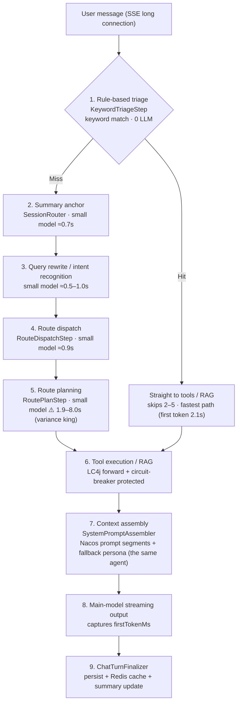
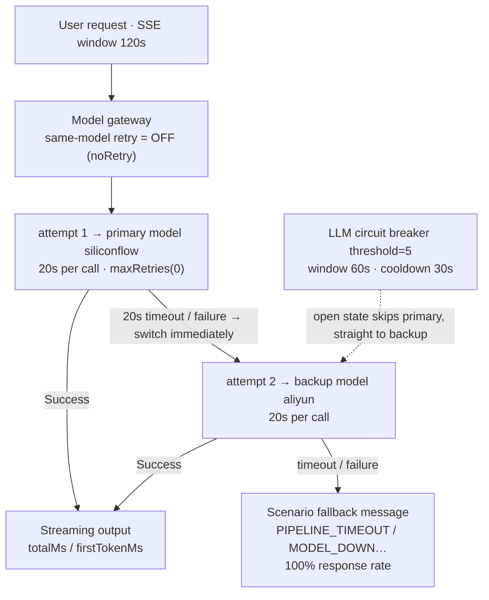
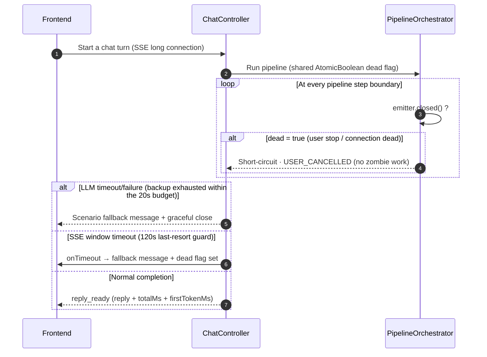
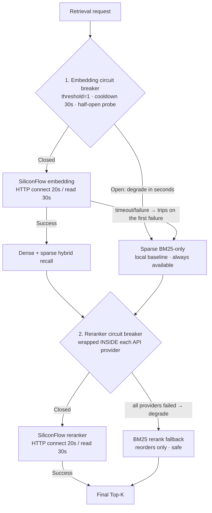

# From 80.5s to 6 Seconds: Full-Chain Latency & Stability Tuning for an E-commerce Customer-Service Agent

> **Language / 语言**: [中文](./2026-09-16-agent-latency-stability-tuning.zh.md) ｜ English
>
> **Project**: Agentdemo007 — the Xiaozhe E-commerce customer-service agent
> **Stack**: Java 17 / Spring Boot 4.1 / LangChain4j 1.19 / LangGraph4j 1.5 / Nacos (config center + prompt templates) / Redis / RabbitMQ / Vue3 frontend
> **Tuning window**: 2026-09-15 ~ 2026-09-16
> **Verification**: 948 tests green (0 failures / 9 smoke-skipped), 33 main-source files changed (+812 / -107)

---

## TL;DR

Behind one seemingly simple Q&A turn sits a multi-stage pipeline: rule-based triage → intent recognition → routing decision → route planning → tools/RAG → context assembly → main-model streaming output. Before this round of tuning, the pipeline exposed three classes of problems: **SSE connections dying silently after timeouts** (fatal), **per-turn latency of 60–90s with wild variance**, and **intent/topic drift**. After tuning:

| Metric | Before | After |
|---|---|---|
| Simple reasoning turn, end-to-end | **80.5s** (first token 80.0s — user staring at typing dots the whole time) | **11.9s** (first token 11.5s, cold-start first turn) |
| Typical turn | 60–90s variance; silent 93s hangs when RAG broke | 6.1–11.9s; rule short-path **first token 2.1s** |
| User experience after LLM timeout | Container killed the SSE connection, **no message at all** | Fallback reply + graceful close; 100% response rate |
| User presses "Stop" | Frontend stops; backend keeps running (zombie work) | Cooperative cancellation at pipeline step boundaries |
| Intent classification | "Please issue a VAT invoice" drifted to **transfer-to-human** | Stable; business requests reach the business path |
| Multi-turn topics | "I just want headphone recommendations" polluted by the previous invoice topic | New topics answered independently |
| Session memory | `append` had zero callers; history was never persisted | Per-turn persistence + Redis cache + summary anchor |
| Fallback persona | "You are a rigorous, safe intelligent assistant" (generic assistant) | The same e-commerce persona as the Nacos config |

The methodology in one sentence: **budget timeouts across the whole chain, relocate retry ownership, give every external dependency a "fail fast + local fallback" path, and hard-isolate the rule layer from the model layer via candidate sets.**

---

## 1. Background: what actually happens in one request

First, know where the cost goes. Between the user hitting send and the main model saying its first word, the pipeline quietly runs **3–5 small-model calls**:



Two things worth noting:

- **A rule hit is the fastest road**: when triage hits, steps 2–5 are skipped entirely; in the final verification log this path produced a first token in 2.1s;
- **Route planning (5) is currently the biggest variance source**: the same type of call swings between 1.9s and 8.0s across turns.

Which means: **if any link in the chain hangs, the user waits** — and before tuning, almost every link had hung at least once.

---

## 2. The fatal one: SSE dies silently after the LLM timeout

### Symptom

The log showed the LLM timeout exception loud and clear, yet the frontend SSE connection simply dropped — **no fallback message whatsoever**. From the user's chair: send a message → watch the spinner → connection dead, nothing shown. This was judged "fatal" in this tuning round.

### Root cause: timeout math is multiplication, not addition

Investigation showed the timeout was never a single-point problem but a whole chain running out of control:

1. **LC4j's default retries were left on**: `OpenAiChatModel` ships with internal retries; a 60s timeout × several retries means one bad request can eat 180s+;
2. **SSE async window of 120s**: on expiry Tomcat kills the connection, while the `onTimeout` callback did **no cleanup** — the pipeline kept running in the background and every "late success" slammed into a closed connection;
3. **Gateway-level same-model retry** stacked on top: one timeout triggered "retry the same model once", doubling the budget again.

### Fix: timeout budget governance + SSE cleanup + cooperative cancellation

First cut: **compress the whole chain's timeout budget into one conservation table**:

| Layer | Config | Value | Failure goes to |
|---|---|---|---|
| SSE async window | `app.sse.timeout-ms` | 120s | `onTimeout` → fallback message + dead flag |
| Single LLM call | `llm.timeout` | **20s** (configurable) | Gateway immediately fails over primary→backup → scenario fallback |
| LC4j internal retries | `maxRetries(0)` | disabled | Retry ownership moves up to the gateway |
| Gateway same-model retry | `RetryPolicy.noRetry()` | disabled | On timeout/failure **switch provider, don't retry** |
| LLM circuit breaker | threshold=5 / window 60s / cooldown 30s | — | Open state: requests never leave the door |
| Embedding/Reranker HTTP | connect 20s / read 30s | — | A bare `new RestTemplate()` (no timeout) was the infinite-hang root |
| Tool circuit breaker | threshold=3 / cooldown 30s | — | Tool degradation, pipeline unblocked |

The 20s rationale lives in the config comment: with thinking off, real calls measured 0.6–2.8s, so 20s = 7–30× headroom; meanwhile SiliconFlow was observed to hang intermittently (a rewrite call hung 60.8s, then succeeded on retry in 0.7s) — **the lower the threshold, the smaller the loss per hang**.

The full primary/backup failover chain after the fix — every failed hop has a defined destination, and the whole thing closes within the SSE 120s window:



Second cut: **SSE lifecycle cleanup**. Three callbacks (`onTimeout` / `onError` / `onCompletion`) share one `AtomicBoolean dead` flag:

- On timeout/error, first push a `PIPELINE_TIMEOUT` fallback message to the user, then mark dead;
- The `ProgressEmitter` interface gained `closed()`; the orchestrator checks it **at every step boundary**: connection dead → record `USER_CANCELLED`, short-circuit the pipeline, stop doing pointless work.

The full SSE lifecycle with cooperative cancellation:



The third cut was a freebie: with the boundary check in place, the frontend "Stop" button went from fake-stop to **real stop** — user clicks stop → dead flag set → the pipeline exits at the next step boundary, and the backend log goes quiet immediately.

### Why `maxRetries(0)` + gateway noRetry double insurance

In the LC4j builder, `maxRetries` only means "retry the same model", while our resilience philosophy is: **retrying the same model most likely replays the same failure; the meaning of a retry should be carried by the gateway's "switch to backup"**. Primary times out at 20s → immediately switch to the backup model → backup also down → scenario fallback message. All three hops are budget-constrained; the worst case still closes inside the SSE 120s window.

---

## 3. Latency anatomy: how the 80.5-second bill was run up

### 3.1 The biggest line item: thinking mode (80.5s → 6.4s)

The first bill came from the reasoning model "thinking". A user asks "what is 2 plus 3 times 4"; with thinking on, the output step ran 35.7s with no first token — Qwen-family reasoning models **emit `reasoning_content` before the answer**, while SSE only streams the answer, so the user stares at typing dots the whole time.

The fix isn't deleting the feature but an **intent-driven default**: chitchat never thinks; everything else defaults to off (`LLM_THINKING_ENABLED=false`); re-enable via environment variable when deep reasoning is needed, and `max-tokens` must be raised in lockstep (1024 often lets reasoning exhaust the budget → empty content → misread as model unavailable).

> Same question measured: thinking on 80.5s → thinking off 6.4s.

### 3.2 The most hidden line item: 93 seconds with no logs

The log showed two blank stretches of 93s and 64s — **not a single LLM egress log**; the request simply vanished. Root cause: the RAG embedding call used a bare `new RestTemplate()` with **no connect or read timeouts**; whenever SiliconFlow hung intermittently, the call was dragged out indefinitely.

Fix in three layers:

1. **HTTP layer**: `SimpleClientHttpRequestFactory` with explicit connect 20s / read 30s;
2. **Circuit-breaker layer**: a new `CircuitBreakerGuard` (threshold=1: a single failure trips it, 30s cooldown then a half-open probe) wrapping the embedding service and **each** reranker API provider. threshold=1 is deliberate — RAG has an always-available local BM25 sparse channel, so when dense/rerank breaks it should degrade in seconds, not retry three times;
3. **Boot layer**: `RagSeedRunner` seed indexing became best-effort try/catch — previously one embedding timeout inside it could take down the whole `@SpringBootTest` context; nothing on the boot path should carry hard external dependencies.

Both RAG degradation chains (embedding down → instantly sparse-only; reranker down → BM25 rerank):



One trap worth calling out: the breaker was first wrapped **outside** `FailoverReranker`, but FailoverReranker swallows provider exceptions internally and degrades to BM25 — the outer breaker never sees a failure and never trips. **Breakers must sit inside every disaster-recovery body that swallows exceptions** — a lesson learned by fixing it wrong first.

### 3.3 The remaining chunk: the route-planning call at 1.9–8.0s

The final verification log shows that among the small-model pre-calls, **route planning (RoutePlanStep) alone took 7.4–8.0s**, 65–75% of first-token latency, with wild variance (the same call took only 1.9s the next turn). This is the next optimization target identified this round — see "Remaining work & next steps".

---

## 4. Intent drift: "issue a VAT invoice" hijacked into transfer-to-human

### Symptom

The user asks for a VAT invoice; the small model classifies the intent as `TRANSFER_TO_HUMAN`, the request gets hijacked by the HITL (human-in-the-loop) step, and the business request never enters the business pipeline.

### Root cause: a polluted candidate set + an un-engineered prompt

Two compounding problems:

1. **Rule-layer-exclusive intents were fed to the model**. `TRANSFER_TO_HUMAN` and `INJECTION` should only ever be hard-matched by keyword rules; putting them in the model's candidate set is asking the model to "guess" an option it should never guess;
2. **The classification prompt had almost no engineering**: no task definition, no classification principles, no per-class business definitions, no examples. Switch models and the output distribution drifts instantly — the user put it sharply: "Given the current state, switching models shouldn't cause drift this extreme."

### Fix: shrink the candidate set + structure the classification prompt

The candidate set keeps only model-selectable classes (CHIT_CHAT / REASONING / LONG_CONTEXT / STRUCTURED_EXTRACTION / OTHER), and the parser adds a second line of defense: even if the model outputs `TRANSFER_TO_HUMAN` it is treated as UNKNOWN and handed back to the rule layer.

The prompt was rewritten with a transferable structure — five parts, none optional:

```
You are the intent classifier of an e-commerce customer-service system.
## Task definition           ← what the job actually is
## Classification principles ← explicit ask wins / transfer-to-human is not a candidate / unsure → OTHER
## Candidate intents         ← one-line business definition each
## Examples                  ← 5 few-shots, including the counter-example:
   "Help me check how to issue a VAT invoice" → OTHER
## Output format             ← output one line: the intent name
## Conversation context      ← last 6 turns
```

The few-shots deliberately include "issue a VAT invoice → OTHER", **a real past drift case** — turning production incidents into test cases is the highest-ROI move in prompt engineering. A companion test pins the prompt's structure (asserting that "principles / candidates / examples / output format" exist and `TRANSFER_TO_HUMAN` is absent from the candidates), so nobody can quietly regress it later.

---

## 5. Topic entanglement: "I just want headphone recommendations" got invoice residue

Multi-turn history was injected into the prompt unconditionally, and the rewriter would "merge context" into the current question — so the previous turn's invoice topic polluted this turn's headphone recommendation.

Two constraints fixed it:

1. **A multi-turn rule in the runtime block**: `If the user's question opens a new topic, answer the new topic directly; combine history only when the question refers back to it (e.g. "it / this / the one just mentioned")`;
2. **A red line for the rewriter**: `must preserve the user's original meaning (never drop or alter their words), only add the context needed to resolve references; strictly forbidden to draw business conclusions on the user's behalf` — the rewriter's job is reference resolution, not intent assignment.

Verified: in the final log, turn 2 "headphone recommendations" stands alone — the reply talks only headphones, zero residue from the previous topic.

---

## 6. Broken session memory: a method with zero callers

Investigation found `SessionCacheService.append(...)` had **no caller anywhere in the main flow** — conversation history was never persisted; multi-turn memory depended entirely on the current request's context: lost on restart, accidental across turns.

Fix: `ChatTurnFinalizer` persists at every turn's end (`chat_turn` table + async persistence + Redis cache + summary anchor); turns the user cancelled skip the history append. The LLM-generated summary also gained a **garbage guard** — echo-style output (contains `{}`) or over-long (>60 chars) is discarded outright, better absent than poisoned, because the summary anchor enters every subsequent turn's prompt.

The final log confirms the memory loop: turn 2's prompt carries turn 1's full Q&A history, and the summary anchor writes correctly (`The user asked a math question: the result of 2 plus 3 times 20`).

---

## 7. Fallback persona drift: falling back must not become "a different product"

Auditing the hardcoded default prompts found SystemAnchorLayer's fallback was a single line "You are a rigorous, safe intelligent assistant" — if the Nacos prompt templates ever failed to load, the same system would **degrade into a completely different persona**.

The fix's one-line principle: **fallback is not degrading into a generic assistant; it's degrading into the same customer-service agent**. All 5 hardcoded prompts were aligned to the Nacos persona:

| Location | Role |
|---|---|
| `SystemAnchorLayer.DEFAULT_SYSTEM_PROMPT` | Full Xiaozhe e-commerce agent persona (duties / tone / safety bounds / format, four sections) |
| `QueryRewriter` | the system's **query rewriter** |
| `LlmSummaryHook` | the system's **conversation summarizer** |
| `RoutePromptBuilder` | the system's **route planner** |
| `IntentRecognizerImpl` | the system's **intent classifier** |

The persona's four sections mirror the Nacos "AI prompt template" role segment segment by segment. The final log confirms both sources (Nacos segments / local fallback) produce a system prompt with the same persona.

---

## 8. Observability: see it first, optimize second

Latency work can only keep moving if every millisecond is attributable. Three pieces were added:

1. **Unified backend timing**: `ChatResponse` carries `totalMs` (end-to-end) and `firstTokenMs` (first token); first-token time is captured by a wrapping emitter at the first `TokenChunk` — the frontend renders "· took 11.9s (first token 11.5s)";
2. **LLM egress logs**: every model call logs `model / durMs / attempt` (e.g. `LLM egress model=siliconflow-small durMs=7405 ok=true attempt=1/2`), making another "93s silent blank" structurally impossible — a blank is itself a clue;
3. **End-to-end trace id**: the frontend shows a trace on every message for direct log lookup.

---

## 9. Verified results: turn-by-turn from the final log

Real integration log from 2026-09-16 12:05–12:08 (production SiliconFlow endpoint, 4 consecutive turns in one session):

| Turn | User input | Path | Pre-call LLMs | User-side latency |
|---|---|---|---|---|
| 1 | What is 2 plus 3 times 20 | REASONING → large model | 869+1017+854+**7405**ms | 11.9s (first token 11.5s) |
| 2 | Headphone recommendations | OTHER → large + queryProduct tool | 728+531+**7962**+944ms | 11.4s (first token 10.6s) |
| 3 | "I want a refund" ×22 (stress spam) | **Rule triage hit** — skips intent/route planning + 2 RAG policy lookups | a single 1214ms call | 11.9s (**first token 2.1s**) |
| 4 | Any phone-case recommendations | OTHER → large + queryProduct tool | 1105+1099+1113+**1946**ms | 6.1s (first token 5.8s) |

The same log confirms every quality-side fix landed:

- **Zero hangs, zero timeout deaths**: not a single 20s+ blank in the whole session; SSE closed gracefully 4/4;
- **Topic isolation**: turn 2 is a clean headphone answer with zero residue;
- **Hostile input**: turn 3's "I want a refund" ×22 spam was absorbed by the rule short-path; the reply correctly gave the return policy with **traceable citations** (Returns policy KB §3, Refund policy KB §2) and a first token of 2.1s — the rule-hit path skips 2–3 pre-calls and is the fastest road in the whole chain;
- **Memory loop**: turns 2/3/4 prompts all carry history and the summary anchor;
- **Consistent persona**: every turn's system prompt opens with the Xiaozhe agent persona.

The full latency journey: **80.5s → 67.1s → 6.4s (thinking off) → 70.5s (RAG outage exposed) → 6.1–11.9s (timeout budget + breakers closed the loop)**.

> A detail worth noting: turns 1 and 4 both had 4 pre-calls yet differ by nearly 2× (11.9s vs 6.1s), almost entirely from the route-planning call (7.4s vs 1.9s). Latency has shifted from "our code is hanging" to "the upstream small-model service's variance" — a categorically different kind of slow.

---

## 10. Lessons learned

1. **Budget timeouts across the chain.** LLM 20s × retries + gateway retry + SSE 120s — one unconstrained link turns all the other careful numbers into decoration. Draw the budget table first, then pick every number.
2. **Relocate retry ownership.** A framework's default "retry the same model" replays the same failure; pull retries up to the gateway where the semantics become "switch to another". `maxRetries(0)` isn't aggressive — it spends retries where success is more likely.
3. **Every external dependency needs "fail fast + local fallback".** Breaker thresholds follow the fallback channel's availability: embedding has an always-on BM25, so threshold=1 degrades in seconds; and breakers must sit inside bodies that swallow exceptions, or they never trip.
4. **Hard-isolate the rule layer from the model layer via candidate sets.** Safety semantics like "transfer to human" and injection detection belong to keyword rules, never the model's candidates; prompt few-shots must include real production drift counter-examples, with tests pinning the prompt structure.
5. **Falling back must not become a different product.** Every degraded path (Nacos load failure, model timeout) must land on the same persona and the same style — users should never sense that degradation happened.
6. **Silent latency is the most expensive latency.** Egress logs (model/duration/attempt) plus first-token timing are what turn "feels slow" into "knows where it's slow".

---

## 11. Remaining work & next steps

| Item | Status | Direction |
|---|---|---|
| **Pre-call consolidation** | 3–5 small-model pre-calls per turn; route planning swings 1.9–8.0s, the largest first-token variance source | Merge intent recognition + routing decision + route planning into 1–2 structured calls; expect another 3–6s off the first token |
| **RAG corpus gap** | 6 seed chunks, no invoicing scenario; invoice questions retrieve no policy | Add invoicing knowledge chunks |
| **Dual-source prompt sync** | Nacos templates and local defaults kept consistent manually | Add diff checks or a release script covering both sources |
| **Rule-triage false hits** | Turn 3's stress spam hit a triage rule (correct outcome; the path is worth watching) | Collect false-hit samples; recalibrate rule confidence |

---

*All figures in this post come from real integration logs against production endpoints and a 948-test regression; code lives on the `develop` branch of the Agentdemo007 repo.*
