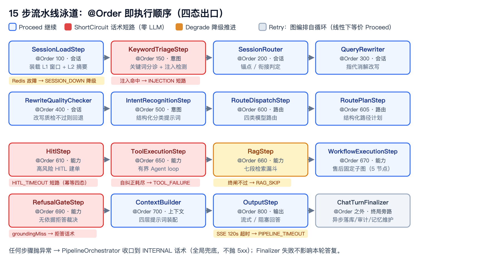
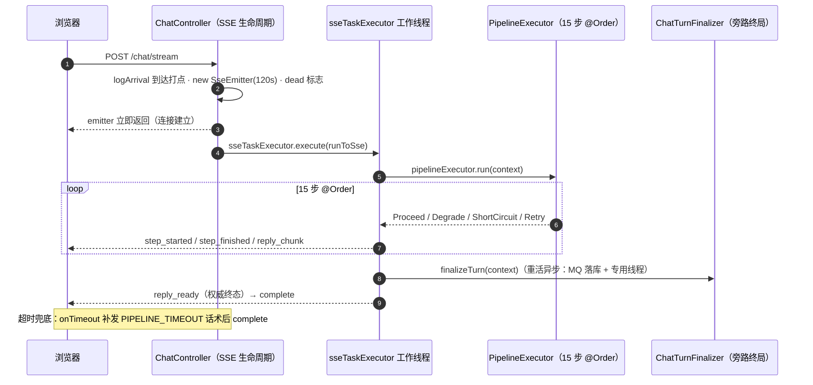

# 设计理念与总体架构：七层蓝图、15 步流水线与四态出口

> **语言 / Language**：中文 ｜ 系列第一章（[目录](./README.md)）｜ 下一章：[提示词工程体系](./2026-09-21-prompt-engineering-system.zh.md)
>
> **项目**：Agentdemo007 —— 电商智能客服 Agent
> **技术栈**：Java 17 / Spring Boot 4.1 / LangChain4j 1.19 / LangGraph4j 1.5.14 / Nacos 3.x / Redis / MySQL / RabbitMQ / Chroma + Lucene
> **周期**：22 个 Phase（工程骨架 → 会话记忆分层），spec → plan → TDD 的文档驱动节奏
> **验证规模**：全量回归测试计数 555 → 948 → 1213 → 1270 → 1353（0 失败 / 11 门控跳过）

---

## 核心结论（TL;DR）

一个电商客服 Agent 从立项到敢挂公网，架构上真正的载荷是几条"宪法级"契约。本章是系列开篇：先给全景，后面十一章都是这几条契约在某一次事故里的具体化。

| 裁决 | 内容 | 落点 |
|---|---|---|
| 一进程即整站 | 前端 SPA 构建直出后端 classpath:/static/，单 jar 同源托管，无需独立前端服务器与 SPA fallback | `vite.config.ts` / `DEPLOY.md` |
| 四态出口 | 每个流水线步骤返回同一 sealed 类型：Proceed / ShortCircuit / Degrade / Retry | `StepOutcome` |
| 状态唯一真相源 | 步骤间禁止私造数据结构传参，一切读写经强类型 `PipelineContext` | `PipelineContext` |
| 主链路线性、图只做固定子图 | LangGraph4j 不接管主链路，只在高风险工作流承担条件分支与循环 | `langgraph/` / `AfterSaleWorkflowGraph` |
| 缓存不是真相源 | Redis 挂不杀轮——对话已异步落 MySQL `chat_turn` | `SessionLoadStep` 定案 |
| 文档驱动 + 诚实注记 | spec → plan → TDD，每处与原设计的偏差在计划文档里留注记 | `DEVELOPMENT-PLAN.md` |

---

## 一、为什么写这个项目

README 里的一句话定位原文：

> 基于 **Spring Boot 4.1 + LangChain4j 1.19 + LangGraph4j 1.5** 构建的电商客服 Agent 单体应用：一条多阶段流水线完成「分诊 → 意图识别 → 路由 → 工具/RAG → 流式回答」，配合超时预算治理、主备模型容灾、断路器与 SSE 生命周期兜底，实现**外部依赖缺失时能力降级而非崩溃**（dev 默认零外部依赖可启动）。

两条设计公理从第一行代码就成立：

1. **外部依赖缺失时能力降级而非崩溃**——dev 环境零外部依赖（无 Nacos/Redis/MySQL/MQ/LLM key）也能启动；后续每一章的"②每步降级"都是这条公理的展开。
2. **敢挂公网当作品集**——闸口过滤器的 javadoc 原话："简历展示站点的对话入口限流"（`gate/AccessGateFilter`）；DEPLOY.md 的口令话术是"本站为作品集演示站点，请输入访问口令（见简历附注）"。"公网"不是口号，是第十二章那批端口收敛与安全清单的由来。

效果先亮出来（详细过程在[第八章](./2026-09-16-agent-latency-stability-tuning.zh.md)）：全链路延迟从 80.5s 降至 6.1~11.9s，规则路径首字 2.1s。

## 二、七层架构：蓝图即目录

`docs/architecture/框架文件.md` 定义了七层流转：接入层 → 会话层 → 意图路由层 → 能力层 → 上下文构建层 → 推理网关层 → 输出层，外加横向支撑（韧性/审计/配置）。这个蓝图没有停留在文档——包结构就是按层落位的：

```text
src/main/java/com/agentdemo007/
├── web/          # 终端与 SSE 生命周期（第一层接入的载体）
├── session/      # 会话缓存/改写/路由（第二层）
├── intent/       # 关键词分诊、意图识别、路由（第三层）
├── capability/   # rag / tool / hitl / workflow / plan / refusal / business / kb（第四层）
├── context/      # SystemPromptAssembler + 四层装配（第五层）
├── gateway/      # 统一模型网关：路由执行器、主备容灾、熔断（第六层）
├── output/       # 结构化输出（第七层）
├── langgraph/    # 图编排节点适配层（主链路线性，图只做固定子图）
├── access/ config/ gate/ resilience/ prompt/ persistence/ common/  # 横向支撑
└── eval/ admin/ observability/ trace/ feedback/             # 质量与可观测
```

蓝图即目录的验收方式很朴素：任何一次线上问题，都能按"第几层出了问题"直接定位到包；本系列后面十一章的每一章，正好对应这一两层。

## 三、收口三件套：一条流水线的宪法

七层之间的运转靠三件套收口：`PipelineContext`（状态）、`StepOutcome`（出口）、`PipelineOrchestrator`（处置）。契约原文（`common/pipeline/PipelineStep.java`）：

> 全部实现本接口：通过 {@link PipelineContext} 读写同一份状态，返回同一 {@link StepOutcome}。……步骤间不私造数据结构互相传参——一切状态经 {@code PipelineContext} 收口（防漂移）。……LangGraph 适配（Phase 14）：本契约即 LangGraph 节点适配层，节点入参/出参都走 {@code PipelineContext}+{@code StepOutcome}，换引擎不换收口。

出口是**四态**而非三态（`StepOutcome.java` javadoc 原文，{@link} 渲染为类名）：

> 每个流水线步骤返回同一个 sealed 类型，四种产出，杜绝各步"各自抛异常/各自返回"的不一致：
>
> - Proceed — 继续下一步（上下文已由本步更新）。
> - ShortCircuit — 话术短路：跳过所有后续步骤、零 LLM、审计后返回预设话术（§5.11）。
> - Degrade — 降级兜底但继续推进（如改写失败回退原问题、RAG 跳过；§5.12）。
> - Retry — 重试本步：图编排下自循环回本节点再执行（工具自纠正，§5.13）；线性编排下等价 Proceed（线性模式不图循环，重试在各 step 内部自理）。由平台 maxIterations 护栏兜底死循环（§5.13）。

```java
// common/pipeline/PipelineStep.java —— 全部 15 步实现这同一个接口
public interface PipelineStep {
    StepOutcome process(PipelineContext context);

    /** 步骤名，默认类名（审计/日志用）。 */
    default String name() {
        return getClass().getSimpleName();
    }
}
```

> 本契约把「①话术短路 + ②每步降级 + ④统一收口」三原则机械统一为同一出口形状。

这四态值得多说一句：**Degrade 和 ShortCircuit 的区别是"系统还答不答"**——Degrade 是"这条能力缺失，换路继续答"；ShortCircuit 是"这句话术就是本轮的答案"（零 LLM）。`PipelineContext` 的 35 个字段全部强类型（非 Map），注释明说"新增字段以强类型（非 Map）声明于此，始终维持单一数据真相源，避免层间数据结构漂移"。

## 四、15 步 @Order：执行顺序即架构

没有"PipelineConfig 总装配类"——Spring 按 `@Order` 自动收集所有 `PipelineStep` Bean，**注解上的数字就是架构**。完整顺序表（与代码逐一对应）：

| @Order | 步骤 | 层 | 职责 |
|---|---|---|---|
| 100 | SessionLoadStep | 会话 | 装载 L1 窗口 + L2 摘要（Redis 故障 → SESSION_DOWN 降级不杀轮） |
| 150 | KeywordTriageStep | 意图 | 关键词分诊 + 注入检测（命中 → INJECTION 短路，零 LLM） |
| 200 | SessionRouter | 会话 | 会话锚点/衔接判定 |
| 300 | QueryRewriter | 会话 | 指代消解改写（划红线：禁止替用户下业务结论） |
| 400 | RewriteQualityChecker | 会话 | 改写质量校验，不过则回退原问题 |
| 500 | IntentRecognitionStep | 意图 | 多层级意图识别（结构化分类提示词） |
| 600 | RouteDispatchStep | 路由 | 四类模型路由 |
| 605 | RoutePlanStep | 路由 | RoutePlan 结构化路径计划 |
| 610 | HitlStep | 能力 | 高风险动作 HITL 建单（幂等四态） |
| 650 | ToolExecutionStep | 能力 | 有界 Agent loop 工具执行 |
| 660 | RagStep | 能力 | 七段检索漏斗 |
| 670 | WorkflowExecutionStep | 能力 | 售后工作流固定子图 |
| 690 | RefusalGateStep | 能力 | 无依据拒答裁决 |
| 700 | ContextBuilder | 上下文 | 四层提示词装配 |
| 800 | OutputStep | 输出 | 流式/阻塞回答生成 |



## 五、图的边界：主链路线性、工作流用图

项目同时引了 LangChain4j（模型执行器桥）与 LangGraph4j 1.5.14——后者**只**承担两种职责：

1. **节点适配**：`langgraph/GraphNode` 的 javadoc 原文——"把既有 PipelineStep……适配为 langgraph4j 节点——换引擎不换收口"；"langgraph4j 的 Map 仅作引擎载体，真正业务状态永远在 PipelineContext 强类型字段内"。
2. **高风险固定子图**：售后工作流 5 节点（`AfterSaleWorkflowGraph` javadoc："非手撸 topo（铁律①：图结构用 langgraph4j StateGraph）"）。主链路保持线性——`app.pipeline.mode` 可切图编排（Phase 14 验收标准原话："编排模式与直接链路输出结果一致"），但生产主路径是顺序流水线。

为什么不让 LLM 动态编排拓扑？[第七章](./2026-09-21-business-tools-workflow-dag.zh.md)的 per-intent-dag 否决记有完整论证：动态图不可测、不可审计、不可回归。这里只补一个工程细节：`NoCloneStateSerializer` 为绕开 langgraph4j 默认 Java 序列化克隆（`PipelineContext` 刻意非 Serializable）而生，代价是放弃快照/回滚且非线程安全——所以**每请求新建图实例**。选型时把框架的隐藏代价算清楚，比记住"用了什么"重要。

## 六、选型答辩：每个依赖都要回答"不用它会怎样"

| 依赖 | 用它什么 | 为什么不是别的 |
|---|---|---|
| Spring Boot 4.1.1 + Java 17 | 单体骨架 | 不引 Spring Cloud 全家桶（非微服务项目）；手动 `@Configuration` 装配，规避 Boot 4 starter 兼容风险 |
| LangChain4j 1.19 | AiServices function-calling 循环 + 韧性扩展点 seam | "用依赖+保韧性不二选一，旧 option B 手撸循环退役"；不引 boot4-starter——它的 auto-config 与自研执行器竞争 bean |
| LangGraph4j 1.5.14 | 图引擎载体（仅固定子图） | "仅依赖 slf4j + async-generator……与 Boot4.1/Jackson3 零冲突" |
| Nacos 3.x | 配置中心 + 提示词远程源 + 闸口旋钮 | 一件中间件三用；"仅作配置中心，不做服务注册与发现" |
| Redis + MySQL 双写 | 缓存 vs 真相源 | "Redis 是缓存不是真相源（对话已异步落 MySQL chat_turn），缓存故障不杀轮"（2026-09-17 定案） |
| Chroma + Lucene | 稠密语义 + 磁盘倒排稀疏 | Chroma 单机不支持稀疏索引（四路证伪）；"JVM 常驻全量语料过不了生产级"（[第五章](./2026-09-21-rag-evolution-abac-refusal.zh.md)） |
| RabbitMQ（dev Noop） | chat_turn/审计异步发布 | "NoopMessagePublisher 仅记日志、不连 broker、不抛异常"——dev 零外部依赖公理的又一处落地 |

每行都回答了"不用它会怎样"，这张表是选型 Review 的实际产出格式，值得照抄。

## 七、方法论：spec → plan → TDD → 诚实注记

22 个 Phase 全部走同一节奏：`docs/design/specs/` 先写设计裁决（为什么这样），`docs/design/plans/` 再写实现计划（怎么落地），代码里以 `[[plan-name]]` 反链引用文档，交付时在计划文档里写**实现注记**——"落地与原设计差异，诚实记录"。一个范例（`DEVELOPMENT-PLAN.md` Phase 13 注记）：

> **实现偏差**：经终端后置钩子 ChatTurnFinalizer（控制器在 orchestrator.run 后调用、独立 try-catch 持久化 + 审计刷出）收口，**取代** dev plan 原列的 CompositeLlmCallbackHandler——更贴合第四原则（终端统一收口）、best-effort 不阻塞响应，满足同一验收"对话完成后 DB 异步写入"。

测试计数随 Phase 演进：555（Phase 17 工具韧性）→ 948（延迟调优）→ 1213（拒答+KB 录入）→ 1270（ABAC）→ 1342 → 1353（记忆分层）。方法论的最后一环是**反思级 review**——"测试全绿 ≠ 完成：测试覆盖不到的并发/事务/资源/边界只能靠走查"。第四章的读-改-写竞态、第五章的并发腿漏等级，都是全绿之后走查走出来的。

## 八、一次请求的旅程

把三件套和 15 步串起来，看一个请求的完整生命周期（`web/ChatController.chatStream`）：



三个容易看漏的细节：

- **到达打点**（`logArrival`，2026-09-18 补）的注释原文："此前首条日志=查询改写 LLM 完成（晚 0.8~2.6s），"发起会话→首条日志"的延迟无法区分传输段与管线段——本行把到达时刻显式落日志"。没有这行，传输段与管线段的耗时在日志里混在一起。
- **HTTP 口径**："任何流水线产出（正常/降级/短路）均 HTTP 200 + code=0（话术短路不暴露技术码）"——技术态与业务态的分离贯穿全栈（[第三章](./2026-09-21-model-gateway-resilience.zh.md)的超限 200、[第十一章](./2026-09-21-observability-audit-trace.zh.md)的降级正交语义都基于它）。
- **终局旁路**：`ChatTurnFinalizer` 在 `reply_ready` 发送前同步收口，但持久化/审计/记忆维护的重活全走异步通道（MQ 投递、专用守护线程），best-effort——它失败不影响本轮答复（[第四章](./2026-09-21-session-memory-layering.zh.md)的压缩就在这条旁路上）。

## 九、经验小结

1. **契约先于实现**。`PipelineStep/StepOutcome/PipelineContext` 三件套在第一个真实步骤之前就定稿，之后 15 步、两种编排引擎、16 个降级场景全部长在同一个出口形状上——契约是唯一的复用单位。
2. **执行顺序即架构**。`@Order` 数字就是部署视图，比任何架构图都不可抵赖；找问题的第一动作是"在第几步"。
3. **框架用它的长板，边界画在它的短板前**。LC4j 只要 function-calling 循环，LangGraph4j 只要图引擎，其余韧性/状态/收口自研——"换引擎不换收口"是检验边界画对了没有的试金石。
4. **选型答辩制**。每个依赖必须回答"不用它会怎样"和"它挂了会怎样"，回答不了的就不引。
5. **文档驱动不是写文档，是写"偏差"**。计划与实现的差异在注记里逐条对账，这是这个系列所有"诚实清单"的制度来源。

## 十、已知边界（诚实清单）

1. **身份即 mock**：`ChatRequest.userId` 客户端声明，无服务端身份绑定（真鉴权接入后收口，[第十章](./2026-09-21-frontend-streaming-ux.zh.md)的身份切换器同源）。
2. **单实例口径**：条纹锁、工单状态机、评测作业管理器均为 JVM 内语义，多实例需分布式原语重构。
3. **可观测有欠账**：无 Prometheus 后端、告警通道 NO_OP、无 OTel——[第十一章](./2026-09-21-observability-audit-trace.zh.md)逐条展开。
4. **dev 的 Rabbit/Redis WARN 靠约定忽略**，`application.yml` 根级 datasource 块是死配置（DEPLOY.md"已知缺口"原话登记）。

---

*本文机制出处：`common/pipeline/`（PipelineStep / StepOutcome / PipelineContext / PipelineOrchestrator）、`langgraph/`（GraphNode / GraphExecutor / NoCloneStateSerializer）、`web/ChatController`；蓝图出处 `docs/architecture/框架文件.md` 与 `docs/DEVELOPMENT-PLAN.md`。*

> 相关阅读：[系列目录](./README.md) · [下一章：提示词工程体系](./2026-09-21-prompt-engineering-system.zh.md) · [第八章·全链路延迟与稳定性调优](./2026-09-16-agent-latency-stability-tuning.zh.md)
