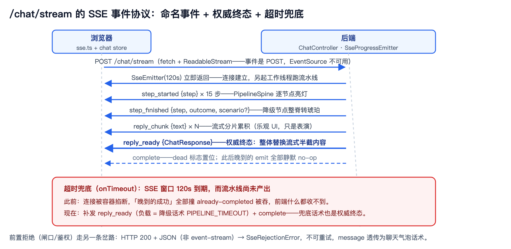
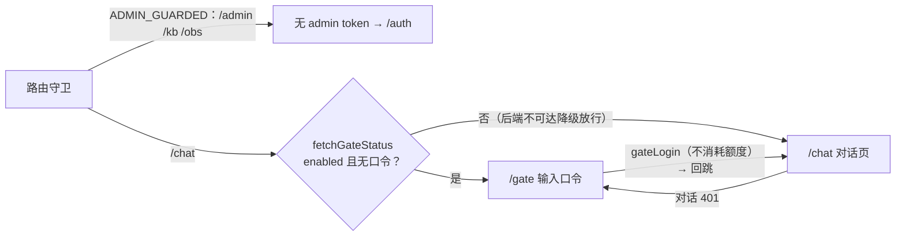

# 前端与流式交互：单 jar 里的 SPA 与一套手撸 SSE 协议

> **语言 / Language**：中文 ｜ 系列第十章（[目录](./README.md)）｜ 上一章：[评测体系](./2026-09-21-eval-harness-hollow-eval.zh.md) ｜ 下一章：[可观测性与审计](./2026-09-21-observability-audit-trace.zh.md)
>
> **项目**：Agentdemo007 —— 电商智能客服 Agent
> **技术栈**：Vue 3.5 / Vite 8 / Pinia / TypeScript 6 / vitest 3（构建产物直出后端 jar）
> **周期**：2026-09-03 前端设计 spec → 09-14 P0 意图切换与流式事件 → 09-18 闸口/登录前置
> **验证规模**：sse.test.ts 264 行（27 例）钉死解析器与消费器语义；chat store / api 层 vitest 覆盖

---

## 核心结论（TL;DR）

前端不是"配一个聊天页面"，是后端每条纪律在浏览器的镜像：HTTP 200 口径、降级标签、权威终态、协作取消——每一项都能在前端找到对应实现。本章记录 SPA 的工程决策、手撸 SSE 的原因与事故、会话状态机的收口规则。

| 问题/裁决 | 内容 | 落点 |
|---|---|---|
| SPA 独立部署还是进 jar | 构建直出后端 `classpath:/static/`，hash 路由零冲突，一进程即整站 | `vite.config.ts` |
| EventSource 不够用 | `/chat/stream` 是 POST——fetch + ReadableStream 自实现解析，纯函数可测 | `utils/sse.ts` |
| 进度与 token 全被丢弃 | parse 层只抽 data 丢事件名——P0 可观测事故 | `extractSseEventName` |
| 流式半截内容可信吗 | reply_ready 终态完整回复为权威口径，整体替换流式分片 | chat store `onTurn` |
| 重试会不会拼出缝合回答 | 重开整条流前清掉半截 token 与步骤轨迹 | `onError` 清场 |
| 登录入口藏不藏 | 401 被动跳转 → 常驻登录 chip（"发布为简历项目，前置可见"） | ChatView 头部 |

---

## 一、单 jar 里的 SPA：两个决策

**产物直出后端 classpath**（`vite.config.ts` 注释原文）：

> 生产构建直出后端 classpath:/static/（单 jar 部署：mvn package 打入 jar，后端 @Controller + 静态资源同源服务；hash 路由故无需 SPA fallback）

**hash 路由**（`router/index.ts` 注释原文）：

> hash 不发往服务端，故 SPA 导航路径与后端 API 路径（/chat /admin/* /eval/run /api/obs/summary）零冲突；dev 代理与生产单 jar 静态托管皆无需 SPA fallback。

history 模式更"现代"，但它把 SPA fallback 的责任推给服务端——单 jar 形态下后端要为所有未命中路径兜底 index.html，与 API 路由表打架。hash 路由用一个 URL 里的 `#` 换掉了整类部署问题。代价（SEO 不友好）对一个作品集演示站不存在。

顺带一提 dev 代理的一行注释：`/chat` 代理项 "SSE (text/event-stream) 不可缓冲：关代理压缩、保流式"——代理缓冲是 SSE 的第一杀手（nginx 侧的同款问题在[第十二章](./2026-09-21-deploy-delivery-hardening.zh.md)）。

## 二、自己撸 SSE：因为 EventSource 天生不够

```ts
// utils/sse.ts 文件头 —— 为什么不用原生 EventSource
// 后端 /chat/stream 为 POST（原生 EventSource 仅 GET 无法 POST），
// 故采用 fetch + ReadableStream 流式读取 + 本解析器切分 data: 事件。
// 本模块仅含纯函数（无网络/无时钟副作用）。
```

两个设计点：

1. **纯函数解析器三件套**：`splitSseStream` 归一 CRLF、按空行切事件；多条 `data:` 行拼接、剥**恰好一个**前导空格（SSE 规范如此，两个空格只剥一个——有专测）、`:` 开头注释跳过，在 `extractSseData`/`extractSseEventName` 里完成。网络与重试在消费器 `streamChat` 里，解析可以离线测。
2. **前置拒绝不可重试**：HTTP 200 + JSON（非 event-stream）是闸口/鉴权的前置拒绝——`SseRejectionError` 的 message 就是后端面向用户的话术，"不可重试（重试也不会变）……由调用方透传气泡"。重试只留给网络类失败（退避 base 500ms × 2ⁿ，cap 8s，"确定性，无抖动"）。

## 三、一次真实事故：事件名被 parse 层扔掉

P0 可观测联调时发现：后端明明发了命名事件（`step_started/step_finished/reply_chunk/reply_ready`），前端进度条纹丝不动、流式 token 也看不到。修复提交里的注释原文（`sse.ts`）：

> P0 可观测：后端 /chat/stream 用命名事件（step_started/step_finished/reply_chunk/reply_ready），前端此前只抽 data 丢弃事件名——**逐步进度与流式 token 因此全被 parse 层扔掉**。

根因是解析器只实现了 SSE 规范的 data 通道，没实现 event 通道。事故的教训有两层：**协议的两端要有一份共同的事件名清单**（发送侧同用这套：`SseProgressEmitter` 映射 step_started/step_finished/reply_chunk，`ChatController` 终端发 reply_ready）；**parse 层丢信息是静默的**——事件名丢了不算错，只是功能蒸发，这类问题只能靠端到端联调或协议测试暴露。

## 四、用测试钉住协议：sse.test.ts 的五组关键语义

264 行测试文件（7 组 describe、27 例）把 SSE 客户端语义逐条钉死，挑五组关键的：

| 语义 | 断言要点 |
|---|---|
| 切分与残留 | 跨 read 重组：`['data:hel','lo\n\n','data:world\n\n']` → hello/world；CRLF 归一 |
| 空格剥离 | "strips exactly one leading space"——两个空格只剥一个 |
| 重试与中止 | 500 耗尽 → onError(willRetry=false)；中止 → 只 onClose（"退避期间立即唤醒"是实现行为——`delay()` 被中止即 resolve，非测试断言） |
| 命名事件 | onEvent 优先通道、onMessage 不再投递；无名事件缺省 'message' |
| 前置拒绝 | `{code:429, message:'今日体验轮次已用完，欢迎明天再来'}` → fetch 恰 1 次、onOpen/onEvent 不触发、话术**逐字**断言 |

最后一组最有意思：后端话术改动会直接打红前端测试——话术在这套系统里是契约，不是文案。



## 五、会话状态机：乐观占位、权威终态、重试清场

```ts
// stores/chat.ts —— 流式会话的收口三规则（简化示意；源码注释逐字保留）
sendStream() {
  // ① 乐观占位：先 push user 消息 + 空内容 assistant 占位
}
onChunk(text) {
  this.m.content += text            // ② 流式分片累积
}
onTurn(res) {
  // 终态完整回复为权威口径：整体替换流式半截内容
  this.m.content = res.reply
}
onError(err, willRetry) {
  if (willRetry) {
    // 退避重试将重开整条流：清掉半截 token 与步骤轨迹，避免跨 attempt 拼接
    this.m.content = ''; this.steps = []
    return
  }
  if (!gotTurn) {
    // 闸口/鉴权拒绝（SseRejectionError）透传后端话术；其余网络错误用通用兜底
    this.m.content = err?.message || FALLBACK
  }
}
```

非重试错误再分两路：尚未收到终态（`gotTurn=false`）→ 写入 `err.message` 或通用兜底话术并置 `degraded`，不清掉已渲染的占位；已收到终态 → 什么都不动，权威回复保留。

第三条最关键：**流式分片只是"正在打字"的表演，`reply_ready` 的完整回复才是权威口径**。没有整体替换，任何分片丢失/乱序都会留下残缺回答；有了它，分片通道可以大胆做 best-effort（`api/chat.ts` 注释："未知事件名/载荷形状不符→静默丢弃（进度 best-effort）"）。

降级口径在前端的形态：HTTP 200 + code（`api/http.ts` 注释："后端始终 HTTP 200（含话术短路/降级，①②不暴露技术码），逻辑结果在 code：0=成功，非 0=逻辑错误"）；`degraded:true` 的消息气泡带琥珀边框和"降级·系统仍答"标签。

## 六、视图三件套与 citations 的诚实

- **PipelineSpine（流水线脊）**：七层架构节点链直接做成 UI——"这是 Agentdemo007 真实的请求处理流（非装饰）。活跃节点磷光青、降级态整脊转琥珀，编码「健康实时 vs 系统仍答」两条核心态"。`step_finished` 事件驱动它逐节点亮灯/转琥珀。
- **citations 标签**：`MessageBubble` 里引用来源区的标签原文——**"参考来源 · 可追溯不等于绝对正确"**。一句话把 RAG 红队实验（[第五章](./2026-09-21-rag-evolution-abac-refusal.zh.md)）的结论带到了产品文案里。
- **EvalView**：1 秒轮询 `GET /eval/progress`，409 时"自动接上正在跑的进度（页面刷新后同样可续看）"，单次轮询失败静默下一轮重试——[第九章](./2026-09-21-eval-harness-hollow-eval.zh.md)异步化的前端侧。
- **ObservabilityView**：消费 `GET /api/obs/summary` 16 字段，亮灯口径有专门注释："totalTurns 走异步落库（MQ→MySQL）有滞后——只看 chatRequests/totalTurns 会误判"尚无流量""（[第十一章](./2026-09-21-observability-audit-trace.zh.md)展开）。

身份切换器（游客 V0 ~ 10086 V5）是演示的灵魂：`stores/identity.ts` 定义 6 个演示身份，切身份时 `store.clear()` 清空会话——注释原话："旧会话历史可能含高等级档知识答案，携带进低等级会话会污染演示观感"。演示细节里也藏着权限纪律。

## 七、三重前端闸口与常驻登录



三份凭证两类去处：访问口令与 admin token 各占一个 `localStorage` 键（前者轮换后旧值自然失效——401 自动回登录页），eval token 仅在视图内输入、经请求头出站，不落浏览器存储（权威值在后端配置）。一个有意思的产品裁决写在 ChatView 注释里：

> 2026-09-18 用户裁决：发布为简历项目，登录入口前置可见，不再只靠 401 被动跳转。

路由守卫还留了一手降级："后端不可达时不拦（降级放行，AccessGateFilter 仍在对话入口兜底）"——前端守卫是体验优化，后端过滤器才是安全边界，两道闸的职责分工从不混淆。

## 八、经验小结

1. **hash 路由 + 产物进 jar 是被部署形态倒推的决策**：单 jar 里 SPA fallback 的麻烦比 hash 的 URL 难看值钱。
2. **协议解析器要纯函数化**：SSE 语义（空格/残留/注释/事件名）全部离线可测，网络壳单独测。
3. **流式是表演，终态是权威**：乐观占位、分片累积、整体替换、重试清场——四步缺一都会有"缝合怪回答"。
4. **话术即契约**：前端逐字断言后端话术，改文案会打红测试——这是故意的。
5. **前端守卫是体验，后端过滤器是安全**：降级放行的注释把这条边界写在了代码里。

## 九、已知边界（诚实清单）

1. **ECharts 体积**：ObservabilityView 懒加载 chunk ~1MB（"全量 ECharts 打入该懒加载块……后续可改按需 import 瘦身"，DEPLOY.md 构建 chunk 清单登记）。
2. **EventSource 降级轮询只是预案**：代理缓冲导致 SSE 失效时的降级方案在计划文档里登记，未实现——当前靠 nginx `proxy_buffering off`（[第十二章](./2026-09-21-deploy-delivery-hardening.zh.md)）。
3. **身份即 mock**：6 个演示身份由客户端声明，真鉴权接入后收口（[第一章](./2026-09-21-design-philosophy-architecture.zh.md)诚实清单同条）。
4. **口令存 localStorage**：演示站可接受的安全预算；token 类凭证的生产化要换 HttpOnly Cookie 体系。

---

*本文机制出处：`frontend/src/utils/sse.ts` + `sse.test.ts`、`frontend/src/stores/chat.ts` / `identity.ts`、`frontend/src/api/{chat,http,gate,auth}.ts`、`frontend/src/views/{chat,eval,observability,auth,gate}/`、`frontend/vite.config.ts`；发送侧协议见 `web/SseProgressEmitter`。*

> 相关阅读：[系列目录](./README.md) · [上一章：评测体系](./2026-09-21-eval-harness-hollow-eval.zh.md) · [下一章：可观测性与审计](./2026-09-21-observability-audit-trace.zh.md) · [第十二章·nginx 侧的 SSE 缓冲治理](./2026-09-21-deploy-delivery-hardening.zh.md)
