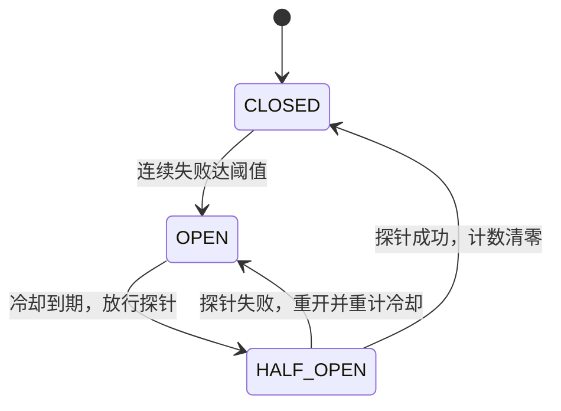
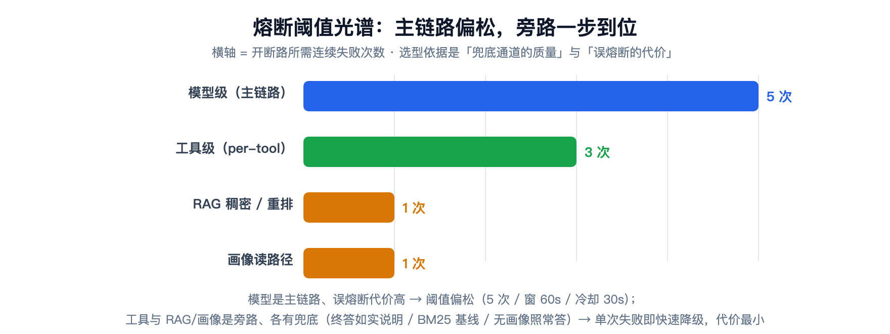

# 模型网关与韧性治理：异常分诊、重试归属地与一张熔断阈值光谱

> **语言 / Language**：中文 ｜ 系列第三章（[目录](./README.md)）｜ 上一章：[提示词工程体系](./2026-09-21-prompt-engineering-system.zh.md)
>
> **项目**：Agentdemo007 —— 电商智能客服 Agent
> **技术栈**：Java 17 / Spring Boot / 自研 resilience 包（分诊·退避·熔断）+ LangChain4j 执行器桥
> **周期**：Phase 4/5（模型网关 + 韧性层）→ 2026-09-17 Phase 17（per-tool 熔断 + 有界 Agent loop）
> **验证规模**：Phase 17 交付全量 555 GREEN（新增 10 测零回归）；resilience + gateway 累计 100+ 例单测钉死语义

---

## 核心结论（TL;DR）

韧性不是"加个 try-catch"，是一套**分诊 → 重试 → 熔断 → 话术收口**的分层体系。这一章记录它的四个设计裁决与三个实测教训：

| 裁决/问题 | 内容 | 落点 |
|---|---|---|
| 异常先分诊再处置 | 四层：可重试瞬态 / 客户端错误 / 工具可自纠正 / 致命拦截 | `ExceptionTriage` |
| 重试的归属地 | 同模型退避与"换模型"是正交的两件事，不混在一个循环里 | `ResilientExecutor` + `FailoverExecutor` |
| 熔断阈值不是同一个数 | 模型 5 次 / 工具 3 次 / RAG 与画像 1 次——按兜底质量与误熔断代价选 | 阈值光谱 |
| 超限返回 HTTP 200 | 我方预算超限是业务态不是系统态，话术短路不抛 429 | `TokenBudgetChecker` |
| 教训：并发丢失更新 | 多线程共享熔断实例 `++failures` 丢计数，"熔断该开不开" | `synchronized` + 并发测试 |
| 教训：间歇性成功掩盖故障 | 连续失败计数一次成功即清零 → 换滑动窗口（偶发成功不清窗） | `WindowedCircuitBreaker` |
| 教训：自纠正会死循环 | 工具失败回喂 LLM 再试，无上限就转圈 | 有界 Agent loop（≤2 轮） |

---

## 一、异常先分诊：不是所有异常都配重试

韧性层的第一块积木不是重试器，是**分诊器**。所有出站异常先归入四类，每一类的处置完全不同：

| 类别 | 典型异常 | 处置 |
|---|---|---|
| `RETRYABLE_TRANSIENT` | 429 限流 / 5xx / 超时 | 指数退避重试，耗尽交故障转移 |
| `NON_RETRYABLE_CLIENT` | 401 / 403 / 404 | 立即失败——重试同参数无意义 |
| `TOOL_RECOVERABLE` | 工具参数错误 | 结构化错误反馈 LLM 自纠正 |
| `FATAL` | 注入 / 权限 | 审计失败，不提交 LLM |

分诊顺序的原则是"最致命、最特定优先"：FATAL 最先判，未知 `RuntimeException` 最后兜底为可重试——**乐观重试，熔断器兜底系统性故障**，两个机制互为对方的后备。

分诊表里最有意思的一条边界是**"提供方的 429"和"我方的 429"必须区分**：

```java
// resilience/ExceptionTriage.java —— 分诊核心片段
if (t instanceof TransientException te) {
    return TriageResult.of(ExceptionCategory.RETRYABLE_TRANSIENT, te.retryAfterMs(), "瞬态可重试");
}
if (t instanceof RateLimitExceededException) {
    return TriageResult.of(ExceptionCategory.NON_RETRYABLE_CLIENT, -1L, "我方预算超限：不重试");
}
```

提供方 429 是"它忙，等会儿再来"，重试有用；我方预算超限是"这个窗口的额度用完了"，重试只会继续撞墙——归为不可重试，直接向上走话术短路（§四）。

## 二、重试的两个正交轴：同模型退避与换模型

最常见的重试设计错误是把"再试一次"和"换一个"写进同一个循环。本项目的拆分：

- **同模型退避**（`ResilientExecutor`）：包住单模型执行，分诊驱动的指数退避（基数 100ms、倍率 ×2、封顶 10s、全抖动）；
- **换模型**（`FailoverExecutor`）：逐候选各试一次，同模型重试已由内层负责，**外层不再循环重复同模型**。

```java
// resilience/ResilientExecutor.java —— 重试模板：耗尽重抛，交 FailoverExecutor 切备
public <T> T execute(RetryAction<T> action, RetryPolicy policy) {
    for (int attempt = 0; attempt < policy.maxAttempts(); attempt++) {
        try {
            return action.call();
        } catch (RuntimeException e) {
            TriageResult result = triage.triage(e);
            boolean canRetry = result.decision() == Decision.RETRY
                    && attempt + 1 < policy.maxAttempts();
            if (!canRetry) {
                throw e;
            }
            sleeper.sleepMs(computeDelay(result, attempt, policy));
        }
    }
    throw new IllegalStateException("重试循环异常退出");
}

private long computeDelay(TriageResult result, int attempt, RetryPolicy policy) {
    if (result.retryAfterMs() >= 0) {
        return result.retryAfterMs();
    }
    long base = backoff.baseDelayMs(attempt, policy);
    if (!policy.jitter()) {
        return base;
    }
    return (long) (random.nextDouble() * (base + 1));
}
```

三个细节各有讲究：

- **Retry-After 原样遵循、不二次抖动**——提供方已经明确告诉你等多久，随机化它是对协议的不礼貌；
- **全抖动的落点在执行器**——`BackoffStrategy` 只产出确定性基数（便于单测断言与埋点），随机化在 `ResilientExecutor` 执行时施加，`Sleeper`/`Random` 都是注入缝；
- **Sleeper 被中断时恢复中断标志**——不吞中断是并发代码的礼貌底线。

有个叠加教训在这里补一刀：LC4j 自带的内部重试（默认 2 次、不退避、不感知熔断与 SSE 预算）与这套体系叠加，把一次 120s 超时放大到 121s+——第八章的 `maxRetries(0)` 就是给这套自研体系让路：**框架的重试关掉，重试语义只有一个归属地**。

## 三、熔断：三态机、滑动窗口与阈值光谱

### 3.1 三态机与"时钟可注入"



实现上只有两处值得展开。第一处是**时钟可注入**（`LongSupplier` epochMillis）——三态流转全是时间判断，不注入时钟就只能在单测里 `Thread.sleep`，墙钟一抖测试就 flaky（第四章读路径三道防线里的 WindowedCircuitBreaker 单测同款做法：可注入时钟代替 sleep——同一教训的另一次重现）。

第二处是并发。Phase 17 把熔断器按 toolName 装进 `ConcurrentHashMap`，同工具的多请求线程共享同一实例——注释里留了这句：

> 同 toolName 的多请求线程共享同一实例并竞态 `++consecutiveFailures`，须同步防丢失更新（**否则熔断该开不开**）。

`allowRequest`/`recordSuccess`/`recordFailure` 全部 `synchronized`，并发丢失更新有专门测试钉死。熔断器的全部价值就在"该开的时候开"，丢一次计数就是防线漏一次。

### 3.2 滑动窗口：偶发成功不该清空证据

连续失败计数有个盲区：**一次成功即清零**。依赖"挂 4 次、成功 1 次、再挂 4 次"的间歇性故障，在连续计数下永远不会熔断——偶发成功掩盖系统性故障。滑动窗口（`WindowedCircuitBreaker`）改成"窗口内累计失败次数，**偶发成功不清窗、仅时间衰减**"，这个语义差异专门有一条测试钉死（`closedSuccessDoesNotClearWindow`）。

### 3.3 阈值光谱：为什么不是同一个数



熔断阈值最容易犯的错是"全系统统一一个阈值"。本项目的四个档位各有理由：

- **模型级 5 次 / 窗 60s / 冷却 30s**：模型是主链路，误熔断 = 整轮话术短路，代价最高，阈值刻意偏松；且 per-model 独立计数——设计期就否掉了"单一全局熔断"（会阻断向备选模型切换），由 per-modelId 注册表接线，熔断位于重试循环内侧；
- **工具级 3 次 / 冷却 30s**：工具失败有自纠正与"错误结果如实告知"两级兜底，但完全没兜底也不行，3 次是平衡点；
- **RAG 稠密/重排 1 次**：实测事故——SiliconFlow 嵌入/重排故障期每轮各吃一次读超时（合计约 60s），首轮 70s+。本地 BM25 是恒可用基线，稠密是可选增强，**单次失败即快速降级的代价最小**；
- **画像读路径 1 次**：有"无画像照常答"的完美兜底（第四章）。

一句话总结选型公式：**兜底通道越强、误熔断代价越低，阈值越激进**。另有一个记账口径的细节防误伤：参数非法、幻觉工具名、外部系统 4xx 明确拒绝**不计熔断**——外部系统有应答说明它健康，模型输错参数不该把健康工具打进熔断。

## 四、预算关卡：超限为什么返回 200 而不是 429

`TokenBudgetChecker` 在模型调用**之前**校验速率与日配额，超限抛 `RateLimitExceededException`，零 LLM。有意思的是 HTTP 语义的选择：上层收口为 `RATE_LIMITED` 话术、HTTP 200，不返回 429。

理由是视角问题：对调用方来说 429 意味着"你过一会儿重试"，但**我方预算超限是业务态不是技术态**——这个窗口的额度已经用完，立即重试只会继续撞墙，该给的是一句人话（`RATE_LIMITED` 话术："当前咨询人数较多，请稍后再试。"）。把它做成技术错误码，前端就得为业务态写异常处理，监控里还会多一堆假 5xx/429 告警。

实现里还藏着一个日界坑：

```java
// gateway/core/TokenBudgetChecker.java —— 日配额按 UTC 日界跨天清零
// 保证「日」配额语义在长生命周期下成立，不会随进程运行而永久耗尽
```

按 `epochDay = millis / 86_400_000` 判定跨天——如果按"进程启动时刻 + 24h"滚动，长生命周期进程的"日"配额会变成一次性的。

## 五、有界 Agent loop：自纠正的死循环护栏

Phase 17 之前工具执行是"单次前向"：调一次、拿结果、走人。2026-09-17 按用户裁决推翻——**有界 Agent loop**：探测 → 执行 → 失败把结构化错误（kind/根因/attempts）回喂 LLM 自纠正 → 再试，至多 `app.tool.max-iterations`（默认 2）轮；轮次耗尽不吞不瞒，**失败结果交终答 LLM 如实向客户说明**。

```java
// capability/tool/ResilientToolExecutor.java —— per-tool 断路器包裹 + 失败收口为错误结果
public ToolInvocation invoke(ToolExecutionRequest request) {
    String name = request.name();
    if (!breaker.allow(name)) {
        // OPEN 快速失败：零工具执行，抛出由上层 ToolExecutionStep 收口 TOOL_FAILURE
        throw new ToolCircuitOpenException("工具熔断中：" + name);
    }
    AtomicInteger attempts = new AtomicInteger();
    try {
        String content = resilient.execute(() -> {
            attempts.incrementAndGet();
            return callOnce(request);
        }, retryPolicy);
        breaker.recordSuccess(name);
        return new ToolInvocation(content, null);
    } catch (ToolCircuitOpenException e) {
        throw e; // 防御透传：callOnce 不产生该类型，熔断开路必须上抛收口而非转错误结果
        } catch (RuntimeException e) {
            ToolError error = new ToolError(kindOf(e), rootMessage(e), attempts.get());
            boolean breakerWorthy = breakerWorthy(e);
            if (breakerWorthy) {
                breaker.recordFailure(name);
            }
            log.warn("工具调用失败收口为错误结果（回喂 LLM）：tool={} kind={} attempts={} breakerWorthy={} message={}",
                    name, error.kind(), error.attempts(), breakerWorthy, error.message()); // 审计
            return new ToolInvocation(error.toText(name), error);
        }
}
```

自纠正 + 重试 + 熔断三层叠在一起，护栏就三句话：**自纠正有轮次上限**（防死循环）、**重试有分诊**（防无意义重试）、**熔断有记账口径**（防误伤健康工具）。Phase 17 的验收标准原话是"熔断不阻塞主链路（②每步降级），不触发自纠正死循环"——风险表里登记过的"工具自纠正死循环"，由轮次上限补齐。

## 六、PromptSanitizer：包裹是收口，也是例外管理

所有经 `ChatLlmService` 的出站调用被**强制**经 `PromptSanitizer` 包裹：用户内容夹进 `[USER_INPUT_START]/[USER_INPUT_END]` 定界符，内容中出现的定界符先中和为 `[REDACTED]`——注入指令无法逃逸数据区。

值得记录的是例外：`chatRaw`（组装好的多段 prompt）**不二次包裹**。原因写在注释里：组装 prompt 内含 System/Runtime/His/RAG/Tool/User 多层，二次 sanitize 会把整条（含 System 锚点）当用户数据包裹，破坏层级结构。**强制收口 + 显式登记的例外**，比"处处 sanitize 但没人知道哪层生效"诚实。

## 七、流式与容灾的边界

流式路径有一个天然限制：**SSE 已经吐出去的字收不回来，中途切备/重试会输出两段拼接的回答**。所以流式出站不做中途容灾；调用方（OutputStep）在流式失败时回退**阻塞 invoke**——那条路有完整的主备容灾，韧性不丢，代价是用户重等一轮。这是"韧性"与"体验"的一次明码标价：流式要流畅，容灾要完整，两者在故障场景下二选一，选后者。

配套的可观测也补过一次漏：流式出站此前零日志（同步路径有 `FailoverExecutor` 的"LLM出站"行，流式不经它）——补一行出站登记，93s 静默挂起这类"无日志空白"从此不可能再发生（第八章的教训在网关层的延伸）。

## 八、经验小结

1. **分诊先于重试**。异常是带语义的，"重试一切"和"从不重试"一样懒。四类处置 + "最致命最特定优先"的判序，让每个异常都有唯一去向。
2. **重试与故障转移是正交轴**。内层同模型退避、外层换模型，各管各的预算；框架内置重试必须关掉，语义才只有一个归属地。
3. **熔断器的全部价值在"该开就开"**。并发丢失更新、偶发成功清零证据，都是"该开没开"的变体；时钟注入让三态机可测而不是靠 sleep 碰运气。
4. **阈值按兜底质量与误熔断代价分级**，不做全系统一刀切；记账口径（谁配计入失败）与阈值同样重要。
5. **业务态别伪装成技术态**。我方预算超限收口为 HTTP 200 话术，监控与前端都更诚实。
6. **自纠正必须带轮次上限**，且耗尽后的正确动作是"如实告知"，不是静默吞掉。

## 九、已知边界（诚实清单）

1. **流式无中途容灾**：流式失败回退阻塞重跑，用户重等一轮（有意取舍，非缺陷）。
2. **权重热生效仅限两次刷新之间**：dev 内存源的"热生效"语义有边界，Nacos 真源接入后收口。
3. **文档与现状的一处漂移**：开发计划记载的 `ToolExecutorCircuitTest` 已被 `ResilientToolExecutorTest` / `ToolCircuitWiringTest` 覆盖取代——计划的"产出文件"清单不追踪后续重构，语义等价但文件名已变。
4. **熔断阈值未接 Nacos**：模型/工具两档走配置文件 + 环境变量（`LLM_CB_*`、工具默认 3 次），RAG 与画像两档是代码常量（阈值 1）——热更新调参随配置中心演进。

---

*本文机制出处：`resilience/`（ExceptionTriage / ResilientExecutor / CircuitBreaker / WindowedCircuitBreaker / ModelCircuitBreaker）、`gateway/core/`（UnifiedModelGateway / FailoverExecutor / TokenBudgetChecker）、`capability/tool/`（ResilientToolExecutor / ToolCallExecutor）；三态/滑窗语义由 `WindowedCircuitBreakerTest`（8 例）钉死，并发丢失更新由 `CircuitBreakerConcurrencyTest` 钉死。*

> 相关阅读：[系列目录](./README.md) · [第八章·全链路延迟与稳定性调优（本章的延迟视角）](./2026-09-16-agent-latency-stability-tuning.zh.md) · [下一章：会话记忆分层（同款阈值 1 的读路径三道防线）](./2026-09-21-session-memory-layering.zh.md)
