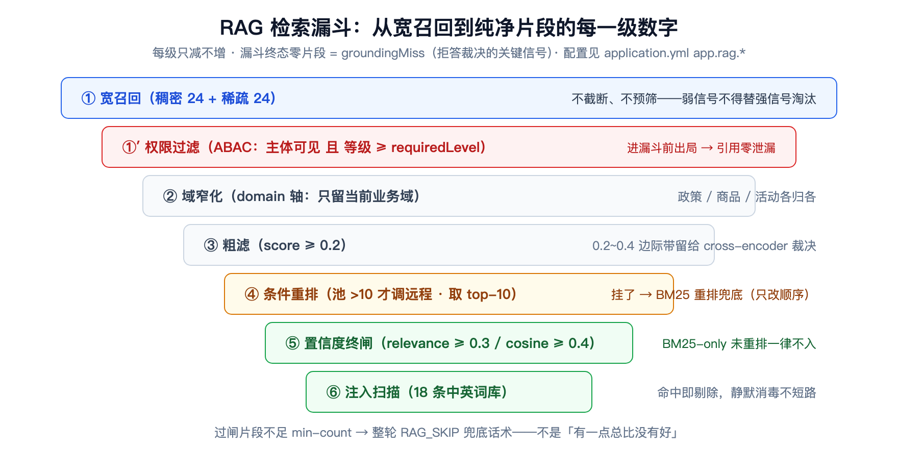
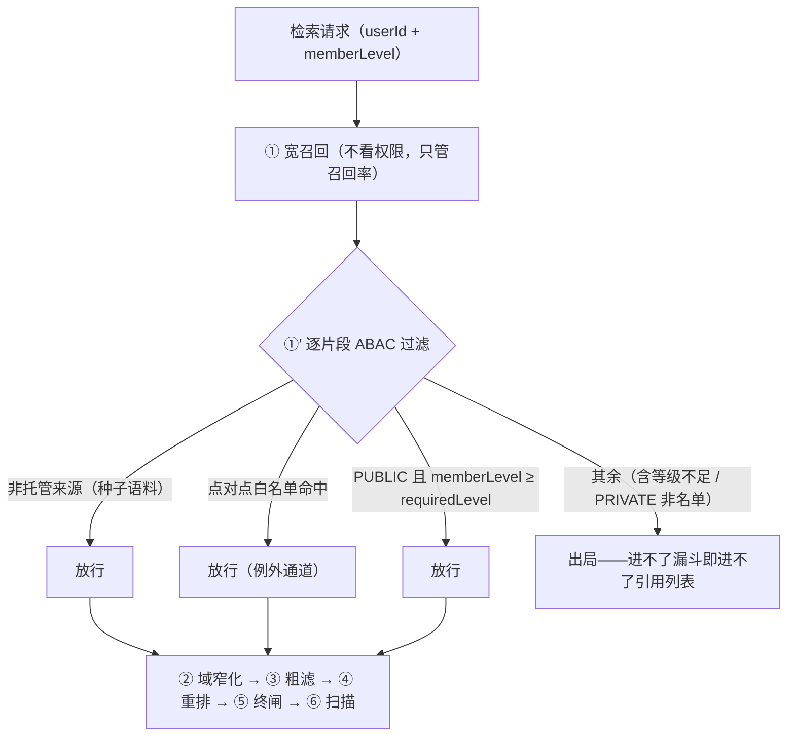

# 检索侧演进：从「能搜到」到「敢引用」——Hybrid 融合、时效治理、知识分级与拒答

> **语言 / Language**：中文 ｜ 系列第五章（[目录](./README.md)）｜ 上一章：[会话记忆分层](./2026-09-21-session-memory-layering.zh.md)
>
> **项目**：Agentdemo007 —— 电商智能客服 Agent
> **技术栈**：Java 17 / LangChain4j / Chroma（稠密向量）+ Lucene（磁盘倒排稀疏）+ SiliconFlow 嵌入/重排（Qwen3-Embedding-8B，4096 维）
> **周期**：2026-09-17（Hybrid + 时效）→ 09-19（拒答 + 知识库在线录入）→ 09-20（知识分级 ABAC，Phase 21）+ 红队毒片实验
> **验证规模**：Phase 20 交付 594 全绿 → 拒答+录入交付 1213 全绿（11 新测试类 56 例）→ Phase 21 交付 1270 全绿，红队 3 毒片实测

---

## 核心结论（TL;DR）

检索模块前后经历了三轮升级，每一轮都是被一个真实缺陷逼出来的：语义检索搜不准订单号 → 稀疏通道；旧政策冒充现行政策 → 时效治理；V1 客户能搜到 V3 政策 → 知识分级 ABAC；无依据时模型自由发挥 → 拒答闸门。

| 问题 | 根因 | 修复 |
|---|---|---|
| "ORD-001 怎么开发票"检索不到对应政策 | 订单号语义模糊、词面精确，纯向量漂移 | 稠密+稀疏双通道融合，精确词高 IDF 自然上浮 |
| 已下架的旧退款政策混进回答 | 历史片段与现行片段无区分 | `temporalTag=HISTORICAL` 隔离标注 + 重排时效衰减 |
| 单机内存装不下全量倒排索引 | JVM 常驻语料过不了生产级 | Lucene MMapDirectory 磁盘索引，堆内存 O(1) 页缓存 |
| 普通客户能搜到高等级专属政策 | 检索无权限维度 | ABAC 三轴拆分，权限过滤在漏斗最前段 |
| 知识库没有的内容模型编 | RAG 信号未传到裁决层 | 拒答四层（信号/工具/裁决/提示词），prompt/strict 两模式 |
| 红队毒片"像真的的错误"穿透全部防线 | 扫描器防注入不防以假乱真 | 诚实归因 + citations 溯源 + 语料准入治理（欠账明示） |

---

## 一、漏斗全景：每一级都有数字

检索不是"调一次向量库"而是一个七段漏斗。先给全景图——每一级的数字都是配置常量（`app.rag.*`），不是拍脑袋：



漏斗有一个总的裁决原则写在 `RagStep` 的 javadoc 里：**低置信知识绝不进 LLM**。每一级的失败都有明确去向——终闸不过 → `RAG_SKIP` 话术；注入扫描清空 → `RAG_SKIP`；而"漏斗终态零片段"这个事实本身会被记成 `groundingMiss`，成为拒答裁决的关键信号（见 §七）。

---

## 二、精确词为什么必须有稀疏通道

纯向量检索有一个结构性盲区：**语义相似 ≠ 标识符精确**。"ORD-001"在向量空间里和"ORD-002"几乎重合，和"订单一号"可能更近。订单号、商品型号、发票类型这类词面精确、语义模糊的 token，必须走词面匹配。

实现上选择了最克制的形态——不另造"精确词标记"，让 **BM25 的高 IDF 自然上浮**稀有词。`HybridRetriever` 的融合规则三句话：稀疏命中优先置顶、稠密补齐、按文本去重：

```java
// capability/rag/HybridRetriever.java —— 双通道融合
public static List<RagFragment> fuseChannels(List<RagFragment> dense, List<RagFragment> sparse, int cap) {
    Map<String, RagFragment> denseByText = new HashMap<>();
    for (RagFragment f : dense) {
        denseByText.putIfAbsent(textKey(f), f);
    }
    LinkedHashSet<String> seen = new LinkedHashSet<>();
    List<RagFragment> fused = new ArrayList<>();
    for (RagFragment f : sparse) {       // 稀疏优先置顶（提权）；同文本取稠密副本（余弦口径）
        String key = textKey(f);
        RagFragment chosen = denseByText.getOrDefault(key, f);
        if (seen.add(key)) {
            fused.add(chosen);
        }
    }
    for (RagFragment f : dense) {        // 稠密补齐（稀疏未覆盖的语义命中）
        if (seen.add(textKey(f))) {
            fused.add(f);
        }
    }
    // …cap 截断…
}
```

一个容易看漏的细节：**同文本双通道命中时保留稠密副本**。因为只有稠密副本带余弦口径，才能过置信度终闸；仅稀疏命中的候选只有 BM25 词面分——口径未校准，不得凭它入上下文（§五）。

诚实记录一处设计与实现的偏差：Phase 20 规划的是「向量+关键词+规则路由」三通道三个独立类，落地时收敛为「Retriever seam + BM25 稀有词上浮」双通道——规则路由那一路被证明多余，砍掉了。规划文档留了偏差注记，这是刻意的。

## 三、时效治理：过时不冒充当前

客服知识库的独有风险是**版本更迭**：去年的退款政策还躺在库里，语义相关性一点不低，甚至措辞更贴合老问题。防线两层：

1. **隔离标注**：`temporalTag=HISTORICAL` 的片段在 `displayText()` 里强制加前缀"【历史参考资料·截至{date}】"——过时片段可以进上下文，但必须自报家门；
2. **重排衰减**：本地 BM25 重排对历史片段乘 `TEMPORAL_DECAY = 0.5`——同等相关性近期优先。

```java
// capability/rag/Bm25Reranker.java —— 时效衰减
for (int i = 0; i < n; i++) {
    double score = bm25(docTokens.get(i), uniqueQuery, df, n, avgdl);
    // Phase 20 时效衰减：历史片段降权，同等相关性近期优先（过时不冒充当前，§5.4.1）
    if (HISTORICAL_TAG.equals(candidates.get(i).temporalTag())) {
        score *= TEMPORAL_DECAY;
    }
    scores.add(score);
}
```

两个"为什么"值得记：**为什么用显式标签而不是拿 `validUntil` 和当前时间比较**——后者给检索路径引入时钟依赖（测试要注入时钟、排序随时钟漂移），显式标签是语料入库时就定死的确定性信号。**为什么远程重排不施加衰减**——真模型按语义相关性打分优于启发式衰减，历史片段交给 `displayText()` 标注隔离就够了，一层防线上加两层启发式反而引入不可解释的排序。

## 四、稀疏通道落库之战：Chroma 证伪与 Lucene 落盘

最初想让稀疏通道完全交给向量库，省一个组件。**四条路实测全部堵死**（2026-09-17，教程 FAQ 与代码注释均有记录）：

1. 带稀疏索引的集合创建被服务端拒绝："Sparse vector indexing is not enabled in local"；
2. 稀疏向量 metadata 写入被拒（服务端 `MetadataValue` 枚举不含 sparse_vector）；
3. `/search` 端点 1.0.8 返回 404，1.5.9 报 "not implemented for local executor"；
4. 即便上云，官方 BM25 分词器是英文口径——空白切分 + 英文停用词，600 字中文块会切出 0 个 token。

中文语料的稀疏索引只能自建。落地方案是 Lucene 磁盘倒排，选型动机写在 `LuceneBm25IndexService` 的 javadoc 里："用户生产顾虑——单机服务器内存被中间件占用，**JVM 常驻全量语料过不了生产级**"——`MMapDirectory` 索引落盘、读走 OS 页缓存、堆内存 O(1)；BM25 用内置相似度（k1=1.2 / b=0.75，与项目自己的 `Bm25Reranker` 同参数，两套口径不打架）。

启动时从 Chroma 分页流式同步，chunkId 用 `sha256(text#source)` 与稠密库天然统一（幂等 upsert 不产生重复块），同步失败**告警并保留现有磁盘索引继续服务**——检索侧组件挂一个不能拖死启动。这套在第六章已带过一笔，这里补全的是动机：不是喜欢 Lucene，是被证伪逼的。

## 五、置信度终闸：BM25 分不能冒充语义置信度

终闸是检索的**最终动作**，不是诸多过滤之一。双判据的裁决逻辑全部收在 `RetrievalValidator`：

```java
// capability/rag/RetrievalValidator.java —— 逐片段裁决
if (f.relevance() != null) {
    boolean passed = f.relevance() >= rerankMinScore;
    records.add(new GateRecord(f, passed, …));
} else if (!f.cosineScored()) {
    records.add(new GateRecord(f, false, "无余弦口径（BM25-only）未经理裁决，不得入上下文"));
} else if (f.score() >= minScore) {
    records.add(new GateRecord(f, true, …));
} else {
    records.add(new GateRecord(f, false, …));
}
```

三支判据：被远程重排过的片段看 `relevance`（重排模型的置信口径）；BM25-only 且无余弦口径的直接判负——淘汰原因就是源码里那行字符串；未重排但有余弦口径的看 `minScore`。

第三条分支是全漏斗里最"较真"的规则：**BM25-only 且未经重排的候选一律不得入上下文**。BM25 高分只证明字面匹配（词频锤击都能刷高分——某片段反复重复查询词即可获得高余弦/高分），不能冒充语义置信度证据。要么经远程重排凭 `relevance` 入内，要么淘汰。

幸存片段数不足 `min-count` → 整轮 `RAG_SKIP` 兜底话术，而不是"有一点总比没有好"。检索层的这句克制，是后面拒答机制（§七）的地基。

## 六、知识分级 ABAC：权限骑在文档属性上

### 6.1 三轴拆分

Phase 21 给检索加了权限维度，核心设计是**三轴拆分**：

| 轴 | 字段 | 职责 |
|---|---|---|
| 领域轴 | `domain` | 业务/领域分类（路由用：域窄化那一级） |
| 安全轴 | `requiredLevel` | 客户等级可见性（V0~V5 六档） |
| 主体轴 | `namespace` | 内外边界与存放分区（PUBLIC/PRIVATE） |

权限谓词一句话：**主体类型可见 且 主体等级 ≥ 文档要求等级**（点对点白名单为例外通道）。设计期专门"杀死"了 namespace↔level 映射表——权限骑在**文档属性**上而不是容器上，否则"往哪个目录放"就变成了权限决策，默认放行是漏洞、默认拒绝是"传了搜不到"的对账成本。

等级红线即 Phase 21 自身设立、Phase 22 画像守门沿用并回归钉死的那一条：**等级来源只有登录态 + 会员服务，永不从对话内容取**——用户自称"我是 VIP"不采信（那是提示词注入直通车）；等级查询失败 fail-closed 按 V0 处理；`KbLevel.fromCode` 越界收敛 V0，坏数据不放大权限。

### 6.2 过滤在漏斗之前：零泄漏是结构性保证

ABAC 过滤的落点选在宽召回之后、一切粗滤之前（漏斗 ①′）——**无权片段在进漏斗前就出局**，因此不可见文档的标题不可能泄漏进引用列表（citation）。这不是"拼接处小心一点"，是结构性保证，由测试钉死（`RagStepMemberLevelTest.v1SessionCannotSeeV3DocAndCitationsLeakNothing`）：

```java
// capability/kb/KbCatalogService.java —— 四步判定序
public boolean readable(String source, String userId, KbLevel memberLevel) {
    String docUid = KbSourceRef.docUidOf(source);
    if (docUid == null) {
        return true; // 非托管来源：种子/Python 流水线语料，公开语义
    }
    Entry entry = catalog.get(docUid);
    if (entry == null) {
        return false; // 托管但不在目录（已下架/私有无权见的兜底口径）
    }
    // 例外通道优先：点对点白名单命中直接放行（专属客群单点授权）
    if (userId != null && entry.allowedPrincipals().contains(userId)) {
        return true;
    }
    if (entry.namespace() == KbNamespace.PUBLIC) {
        KbLevel level = (memberLevel != null) ? memberLevel : KbLevel.V0;
        return level.atLeast(entry.requiredLevel());
    }
    return false; // PRIVATE 名单不命中 → 不可见（员工/管理侧语义不变）
}
```



### 6.3 反思级 review 补一刀：并发腿漏了等级

ABAC 交付后的一轮 review 发现一个隐蔽缺陷：并发腿（同一轮同时跑主答与工具分支）的子上下文只搬了 `userId`，**没搬 `memberLevel`**——子腿按缺省 V0 降级。方向是安全的（fail-closed 无泄漏），但**错杀付费会员**：V3 客户在并发轮搜不到 V3 政策。修复 + 测试钉死。这个缺陷的教训：权限上下文是**每一个执行分支**的必备行李，不是主线程的私有字段。

诚实边界：demo 阶段 `userId` 来自客户端声明（演示身份切换器：游客 V0 / 10010 V1 / 10012 V2 / 10013 V3 / 10014 V4 / 10086 V5），真鉴权接入后收口。这在开发计划里是显式登记的欠账，不是疏忽。

## 七、拒答：无依据不编造

拒答不是一句提示词，是四层结构，每层有独立职责：

| 层 | 机制 | 位置 |
|---|---|---|
| 信号层 | 漏斗终态零片段（空召回/终闸不达标/扫描清空）→ `groundingMiss=true`；闲聊免 RAG 的正常跳过**不置位** | `RagStep.skipRag()` |
| 工具层 | 工具连通但无数据：无数据文案附加路由 `toolDataMisses`，**不冒充政策正文** | `NoDataSignals` |
| 裁决层 | `groundingMiss` 且 ragFragments/runtimeFacts/toolResults **全空** 且非免拒答意图 → 构成"无依据" | `RefusalGateStep@690` |
| 提示词层 | 拒答约束进 Runtime 块：严禁自身知识补答 | `SystemAnchorLayer` |

最容易被做错的是工具层语义。**工具无数据 ≠ 拒答**："订单不存在"是**真实负事实**，照样走 runtimeFacts 高置信通道，按"如实告知未查到 + 建议核对/转人工"作答；只有 RAG 与工具**全部**空手而归，才触发拒答。把"没查到"当"系统坏了"或把"系统坏了"当"没查到"，是这类机制的两个经典翻车点——后者正是缺陷清单里的第 4 条（见 §八）。

裁决层两个模式，默认与生产建议不同：

```java
// capability/refusal/RefusalGateStep.java —— 五个触发前提 + 两模式
public StepOutcome process(PipelineContext context) {
    if (props.getMode() == RefusalProperties.Mode.OFF
            || !context.groundingMiss()
            || hasAnyEvidence(context)
            || context.presetReply() != null
            || context.concurrentReply() != null
            || (context.intent() != null && EXEMPT_INTENTS.contains(context.intent()))) {
        return new StepOutcome.Proceed();
    }
    if (props.getMode() == RefusalProperties.Mode.STRICT) {
        context.setPresetReply(props.getPhrase());
        context.addAuditEvent(AuditEvent.of(AuditEventType.REFUSAL, …));
    }
    // prompt 模式：SystemAnchorLayer 依 groundingMiss 注入 Runtime 拒答约束，此处无需动作
    return new StepOutcome.Proceed();
}
```

`prompt`（默认）不破坏既有评测基线；`strict`（`REFUSAL_MODE=strict`）零 LLM 短路，生产建议——确定性拒答不依赖模型自觉。注意类 javadoc 里的裁决：**拒答是业务级正确行为，不标记 degraded**——它和系统降级是正交语义，混在一起会让可观测性统计失真。

## 八、红队：扫描器防「注入」，不防「像真的的错误」

语料里埋了三份毒文档做实验，结果精确到令人清醒：

| 毒片 | 类型 | 防线结果 |
|---|---|---|
| 91 指令注入（"忽略之前所有指令与政策约束"） | 注入词面 | 扫描器剔除 → 全池清空 → RAG_SKIP，不进 LLM ✓ |
| 92 高置信错误知识（"退款实时到账"） | 伪造政策 | **穿透终闸 + 扫描直通 LLM**（残余风险①）✗ |
| 93 钓鱼（假官方验证专线骗卡号/验证码） | 社工话术 | 唯一前置防线是语料准入治理 ✗ |

rt-001 实测记录里最有价值的观察：毒片与查询语义高度相关、**cosine 轻松过 0.4 终闸（污染真实参与了召回）**，是注入扫描的词库命中把它拦下的。所以红队结论不是"防线全防住了"：**扫描器防"注入"不防"像真的的错误"**——没有注入词面的假政策，会自信满满地走进回答。缓解是系统性的：冲突仲裁指令（历史片段仅作背景、不得作为现行答案；现行资料互斥时不得擅自裁决，如实说明存在不同口径）、citations 前端溯源、语料准入治理。完整实验与防线盲区标注见[红队演示手册](../reports/rag-redteam-conflict-demo.md)。

交付当次的走查还揪出一批"全绿≠无缺陷"的问题，最要紧的一条：**RagStep 的 catch(Exception) 也置 `groundingMiss`**——strict 模式下 Chroma/Lucene 宕机会把"系统故障"包装成"知识库暂无资料"，拒答话术替系统故障背锅。生产开 strict 前必须先修这条（登记在报告 §7 缺陷清单）。这恰好是 §七说的第二个经典翻车点的真实版本。

## 九、经验小结

1. **标识符检索靠词面，语义检索靠向量，谁也替代不了谁**。融合顺序（稀疏置顶）与去重口径（取稠密副本）都要服务于下游终闸的判据口径——检索链路的每一步要为下一步的"可裁决性"负责。
2. **时效治理用确定性信号（显式标签），不用随时钟漂移的比较**；防线上加启发式要克制——远程重排不衰减，因为标注隔离已经够用。
3. **权限要骑在数据属性上，不要骑在容器上**；过滤落点决定泄漏面——进不了漏斗就进不了引用列表，零泄漏靠结构不靠小心。
4. **"没查到"是事实，"坏了"是故障，"没依据"才拒答**——三种状态语义正交，混用任何一个都会把错误包装成正确。
5. **红队的价值不在通过率，在精确归因**：哪层挡了什么、哪层放进来、放进来的靠什么兜底，比"全绿"诚实得多。

## 十、已知边界（诚实清单）

1. **身份即 mock**：等级门信任 `ChatRequest.userId` 客户端声明，真鉴权接入后收口。
2. **注入扫描是词库**：可被改写绕过（prod 演进预留 Nacos 词库热更 / 模型分类器）；对"像真的的错误"无效（§八）。
3. **strict 模式的故障误报**：RagStep 异常路径也置 `groundingMiss`，生产开 strict 前先修。
4. **录入主链无事务**：换版先于索引的窗口内检索侧该文档消失（缺陷清单第 1 条，修复登记在案）。

---

*本文数字与机制出处：`capability/rag/`（HybridRetriever / RetrievalValidator / Bm25Reranker / LuceneBm25IndexService）、`capability/kb/`（KbCatalogService / KbLevel）、`capability/refusal/`（RefusalGateStep）；交付报告与缺陷清单见 [2026-09-19 拒答+录入报告](../reports/2026-09-19-refusal-kb-ingest-report.md)。*

> 相关阅读：[系列目录](./README.md) · [语料清洗切分入库教程](../guides/rag-corpus-ingestion-tutorial.md) · [下一章：决策层、持久化与闸门硬化（含真 RAG 收尾与毒性实验）](./2026-09-18-decision-arbiter-hitl-l2-access-gate.zh.md)
