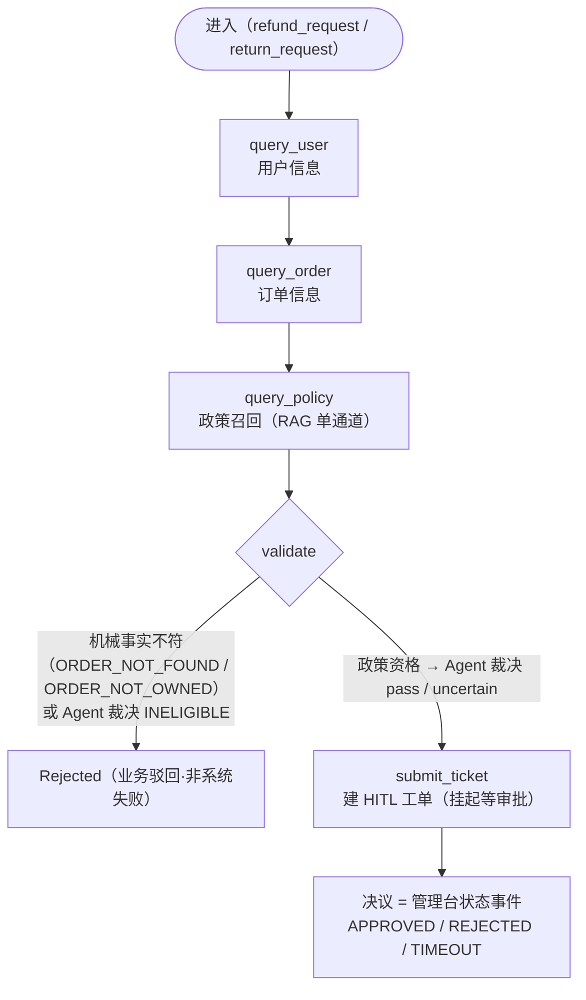
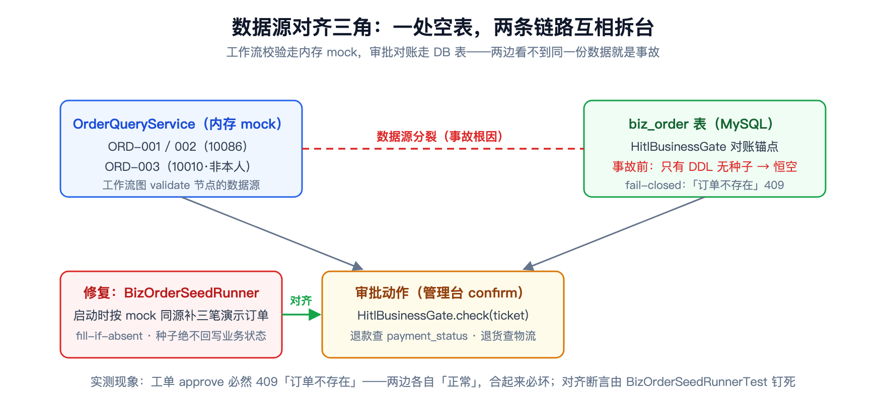
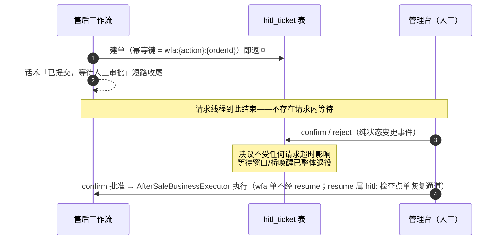

# 业务工具与售后工作流 DAG：从「每意图一张图」的弯路到「审批是事件」

> **语言 / Language**：中文 ｜ 系列第七章（[目录](https://blog.csdn.net/qq_24993561/article/details/166257230)）｜ 上一章：[决策层、持久化与闸门硬化](https://blog.csdn.net/qq_24993561/article/details/166257730)
>
> **项目**：Agentdemo007 —— 电商智能客服 Agent
> **技术栈**：Java 17 / LangGraph4j（固定工作流子图）/ LC4j 工具前向 / HITL L2 三级持久化
> **周期**：2026-09-12（设计 + 方向纠偏）→ 09-15（工作流冲刺）→ 09-19~20（提交制 + 对账修复）
> **验证规模**：workflow 74 例 + HITL 84 例 + 业务工具 36 例单测；全量回归随各 Phase 交付
> **源码**：[github.com/Gavincui123/Agentdemo007](https://github.com/Gavincui123/Agentdemo007)

---

## 核心结论

业务工具层要回答的问题是：当对话需要"真的办事"——查订单、办退款、建工单——怎么把 LLM 的不确定性关进确定性系统的笼子。

这一章的主线不是设计展示，是弯路和事故清单：我先在"每意图动态生成 DAG"上犯了一次系统性过度设计，设计推演阶段自己否决了自己；落地后又接连踩到 LangGraph4j 的迭代预算陷阱、一个被用户看成"系统说谎"的小写订单号、一次管理台必现的 409 对账故障。

最后靠两次原则级收口定型——审批是事件、建单走四态幂等门——每一段弯路的尽头都站着一条现在还立着的规矩。

## 一、方向纠偏：「每意图动态 DAG」被否决的经过

业务工具层的第一份设计（`per-intent-dag`）雄心勃勃：每个意图动态生成一张 DagSpec 图，按需编排节点。这个方向在设计推演阶段就被我自己否决了，回滚记录就写在计划文档的开头：RoutePlan 只是每请求的结构化路径计划，本身无 DAG；低风险意图靠现有固定 @Order 链加 #135 自跳过，也无 DAG；DAG 的落点只有一处——高风险操作时在 LangGraph 构建**固定**工作流子图。

否决的理由今天看依然成立：动态图的拓扑随 LLM 输出漂移。不可测——每个输入都可能长出一张新图，用例没法写；不可审计——事后说不清当时到底跑了哪张图；不可回归——golden 用例锚不住拓扑。固定子图加明确的进入条件（售后动作 + 订单号），把"要不要跑图"交给上游决策层（第六章），图本体保持死板。死板是特性，不是缺陷。

同一份设计里还埋着一个运行时坑：`MAX_ITERATIONS` 从 10 放大到 20。原因很反直觉——**LangGraph4j 的迭代预算按 generator yield 计数，不是按节点数**：每个节点内部的多次 yield、条件边的重入都计数，10 在 deny-retry 边界就会 trip。这类"框架计量单位与直觉不符"的坑，属于不写进文档就一定会有人再踩一次的。

## 二、售后工作流图：五个节点与两种裁决



落地的工作流子图很克制：五个节点、一条条件边。查用户、查订单、查政策是三步串行取证，validate 是唯一的裁决点，submit_ticket 把通过者送进 HITL 工单挂起等审批，Rejected 是业务驳回出口。

关键设计在 validate 节点里两种裁决的分工：

```java
// capability/workflow/AfterSaleWorkflowGraph.java —— 机械事实与政策资格分层
// 机械事实校验（存在/归属——非政策判断，保留代码内，短路即驳）
if (order == null) {
    Reason fail = Reason.ORDER_NOT_FOUND;
    return Map.of(FAIL_KEY, fail, OUTCOME_KEY, (AfterSaleWorkflowOutcome) new AfterSaleWorkflowOutcome.Rejected(…));
}
String uid = resolveUserId(ctx);
if (uid != null && !uid.equals(order.userId())) {
    Reason fail = Reason.ORDER_NOT_OWNED;
    return Map.of(FAIL_KEY, fail, OUTCOME_KEY, (AfterSaleWorkflowOutcome) new AfterSaleWorkflowOutcome.Rejected(…));
}
// 政策资格 → Agent 裁决（2026-09-19 用户裁决）：政策知识（query_policy 召回）+ 实时事实
//（订单记录 + 当前日期）一并交模型三态裁决；裁决器内部全降级（失败=UNCERTAIN fail-safe
// 到人工，绝不冒充业务驳回、绝不盲目放行）
```

**机械事实（订单在不在、是不是你的）留在代码里**——确定性判断不需要模型意见，短路即驳；**政策资格（7 天无理由适不适用这一单）交给模型三态裁决**——它需要读召回的政策、比对订单记录和当前日期。裁决失败的落点既不是拒绝也不是放行，而是 `UNCERTAIN`：进人工审批，且管理员重点复核。不确定是一种合法输出，fail-safe 到人，模型意见永远不可能单独驳回或放行一笔业务。

业务驳回还有一层语义收口：`Rejected` 是**业务终态**（话术直接答复"这单不符合条件"），不是 `DegradationScenario`——系统没坏，是业务说不。把业务结果混进降级枚举，监控就会把正常业务拒绝算成故障率。

## 三、一次误拒的两个教训：小写订单号与空表对账

### 3.1 用户说 "ord-001"：入口归一化

实测：用户小写输入 "ord-001" 原样进 `OrderQueryService` 的精确键查找 → miss → 误判 `ORDER_NOT_FOUND`，答复"订单不存在"。订单明明就在 mock 里，用户视角这就是系统说谎。修复在服务端入口做防御性归一化：

```java
// capability/business/OrderQueryService.java —— mock 三笔订单覆盖 validate 全部分支
public Optional<OrderRecord> findByOrderId(String orderId) {
    if (orderId == null) { return Optional.empty(); }
    // 防御性归一化（trim+大写）：调用方可能传用户原话里的 "ord-001"（精确键会 miss）
    return Optional.ofNullable(ORDERS.get(orderId.trim().toUpperCase(java.util.Locale.ROOT)));
}
```

教训一句话：**标识符在系统边界处归一化一次，而不是要求每个调用方记得归一化**。这条后来写进了订单号提取的统一契约（raw 优先、standardQuery 兜底，《决策层、持久化与闸门硬化》§2.4）。

### 3.2 更疼的一个：mock 与 DB 各说各话

2026-09-20 联调，管理台点"批准退款"必然 409「订单不存在」——而工作流校验明明通过了。排查结论写在 `BizOrderSeedRunner` 的 javadoc 里，是一教科书级的**数据源分裂**：

> 数据源分裂根因：工作流图校验（订单存在/归属）走 OrderQueryService 内存 mock……而 HitlBusinessGate 对账走 biz_order 表——表只有 DDL 无种子，运行时恒空 → 管理台 confirm 必然 fail-closed「订单不存在」。

两条链路各自"正常"：校验查内存 mock，查得到；对账查 biz_order 表，按 fail-closed 拒绝——单看都对，合起来必坏。



修复是启动时 `BizOrderSeedRunner` 写入与 mock **同源对齐**的三笔演示订单，配两条铁律：**fill-if-absent**，只补空缺不覆盖——业务表是对账锚点，种子绝不回写业务状态，否则测试数据会污染真实审批结果；`app.biz-order.seed.enabled=false` 可关，生产接真数据。mock↔DB 对齐由 `BizOrderSeedRunnerTest` 断言钉死——对齐不是口头约定，是测试。

## 四、审批是事件：一次原则翻转

最初的设计是"请求内等待"：工作流发起审批后，请求线程挂起等管理台决议，桥唤醒机制恢复执行。语义直观，但三个毒副作用很快显形：请求线程被审批时长绑架，Tomcat 线程池会被审批队列占满；审批等待与超时语义纠缠，HITL_TIMEOUT 话术发出去之后决议才到，算谁的；恢复路径复杂，桥的状态机要处理进程重启。

2026-09-20 按用户裁决**整体翻转**：



原则的原话落在代码注释里：

> **原则（用户裁决）：审批是事件、Agent 最小权限**——建单即返回，无请求内等待。……决议 = 状态事件，Agent 只查询进度。……**等待窗口/桥唤醒已整体退役，超时不可能影响决议**。——TicketApprovalSubmitter / AfterSaleWorkflowGraph

翻转后的世界简单了很多：请求线程生命周期到建单为止；`WORKFLOW_APPROVAL_TIMEOUT` 场景保留只为指标兼容，决议语义上已不可能超时；恢复是显式管理动作——先过 `HitlBusinessGate` 业务对账，再 CAS 消费检查点，第六章的三级持久化正好接住。**"等待一个人类"从来就不该发生在请求线程里**，这一条适用于一切带人工环节的系统。

三个环节的实测截图，正好凑成一次完整闭环：


## 五、建单幂等：四个状态的门

高风险动作的幂等要答两个问题：幂等键怎么选，命中之后每个状态去哪。工单按业务幂等键查询（工作流审批单 `wfa:{action}:{orderId}`、L2 检查点单 `hitl:{action}:{entity}`），两套单的分派口径同构，只有一处刻意不同——这正是本节最想讲清的地方。先看 L2 检查点单（`HitlStep`，@610）的四个去向：

```java
// capability/hitl/HitlStep.java —— 建单幂等（2026-09-18 L2）
Optional<HumanTicket> existing = ticketService.findByIdempotencyKey(idempotencyKey);
if (existing.isPresent()) {
    HumanTicket prior = existing.get();
    switch (prior.status()) {
        case PENDING -> {
            // 复用挂起单（重复请求/网关重试/重开会话不再爆单）；checkpoint 缺失则补挂（重启丢失兜底）
            context.setHitlTicketId(prior.id());
            ensureCheckpoint(context, prior, idempotencyKey);
            // …（省略 log/metrics）
            return new StepOutcome.ShortCircuit(DegradationScenario.HITL_TIMEOUT);
        }
        case APPROVED -> {
            // 幂等放行：人工已批准过该业务动作（恢复锚定的放行语义），带外预批准同语义
            // …（省略 setHitlTicketId/log/metrics）
            return new StepOutcome.Proceed();
        }
        case REJECTED -> {
            // 人工已驳回该业务动作：不再重审（防"驳回后换会话重提绕过审批"）
            // …（省略 log/metrics）
            return new StepOutcome.ShortCircuit(DegradationScenario.HITL_TIMEOUT);
        }
        case TIMEOUT -> {
            // 超时单：人工未决议，允许重新建单（键索引指向新单，走下方正常流程）
            // …（省略 log；无 return——落到方法下方的正常建单流程）
        }
    }
}
```

四个去向各有一个"为什么"：

- **PENDING 复用**是防重复轰炸——重复请求、网关重试、重开会话都不再爆单，checkpoint 缺失还要补挂，兜住重启丢失；
- **APPROVED 放行**是审批语义的兑现——这笔钱人工批过了，再问一遍不能再执行一遍；
- **TIMEOUT 重建**是给人改口的机会，键索引指向新单；
- **REJECTED** 这一格，两套单刻意走了两个方向：检查点单（上面这段 `HitlStep` 代码）驳回后不再重审；而退款退货真正走的工作流审批单（`TicketApprovalSubmitter`，`wfa:` 键＝工作流审批单的幂等键）javadoc 写明"差异：REJECTED 不封禁再申请"——PENDING 复用同单、APPROVED 已受理不重建（防重复业务动作）、**REJECTED/TIMEOUT 重建新单**。

驳回是"那张工单"的终局事件，不是对用户的永久禁令：重建的是一张新工单，照样要人工审，审批权始终在人手里，放开重建不构成绕过。

**幂等门真正要堵的是"已批准的工单被重复兑现"和"同一申请轰炸出十张挂起单"——这两条，两套门都堵死了。**

## 六、这一章带走的六条

1. **动态图是系统性过度设计的典型症状**。LLM 决定"要不要进图"，图内部保持固定——灵活性与可测试性的边界画在图的门口，而不是图里面。
2. **框架的计量单位要先核实再设预算**。LangGraph4j 的 yield 计数坑属于"不记录必复发"类。
3. **机械事实归代码，价值判断归模型，不确定归人**。validate 节点的三态裁决（pass / rejected / uncertain）让模型的意见永远不可能单独驳回或放行一笔业务。
4. **数据源分裂是集成事故的第一大来源**。两条链路各自测试全绿照样联调必坏；对齐要用种子加断言钉死，且种子不得回写业务状态。
5. **带人工环节的流程，等待必须发生在请求之外**。审批是事件：建单即返回、决议是状态变更、恢复是显式管理动作——超时语义才可能与审批语义彻底解耦。
6. **幂等门的每个状态都是一个产品决策**。复用、放行、不重审（检查点单）、允许重建（工作流单）——枚举不全的幂等只是防重复提交，枚举全了才防得住重复执行。

## 七、已知边界（诚实清单）

1. **userId 客户端声明**：订单归属校验的 `uid` 来自 `ChatRequest.userId`（null 兜底 baked 10086 供演示），真鉴权接入后 per-request 注入收口。
2. **单实例语义**：工单状态机与检查点消费为单实例口径（多实例需 DB 乐观锁，第六章已登记）。
3. **演示身份与 mock 数据**：ORD-001/002/003 覆盖 validate 全部分支是演示口径；真实接入后 mock 退役、对账链路不变。

---

*本文机制出处：`capability/workflow/`（AfterSaleWorkflowGraph / WorkflowExecutionStep / TicketApprovalSubmitter）、`capability/hitl/`（HitlStep / HitlResumeService）、`capability/business/`（OrderQueryService / BizOrderSeedRunner）；设计沿革见 [business-tools-workflow-dag](../design/plans/business-tools-workflow-dag.md) 与 [per-intent-dag](../design/plans/per-intent-dag.md)。*

> 相关阅读：[系列目录](https://blog.csdn.net/qq_24993561/article/details/166257230) · [第六章·决策层、持久化与闸门硬化](https://blog.csdn.net/qq_24993561/article/details/166257730) · [第四章·L0 业务键注册表](https://blog.csdn.net/qq_24993561/article/details/166257790) · [下一章：全链路延迟与稳定性调优](https://blog.csdn.net/qq_24993561/article/details/166257713)
