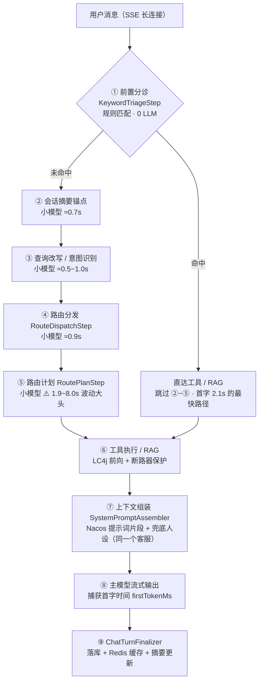
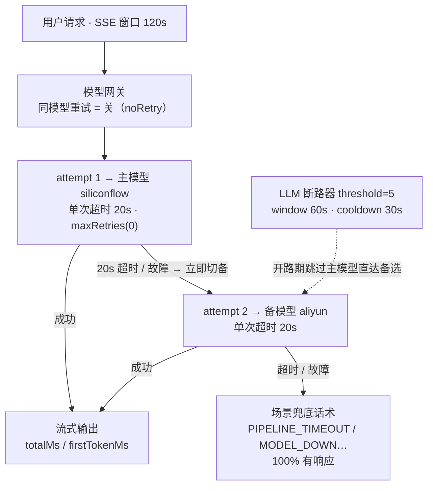
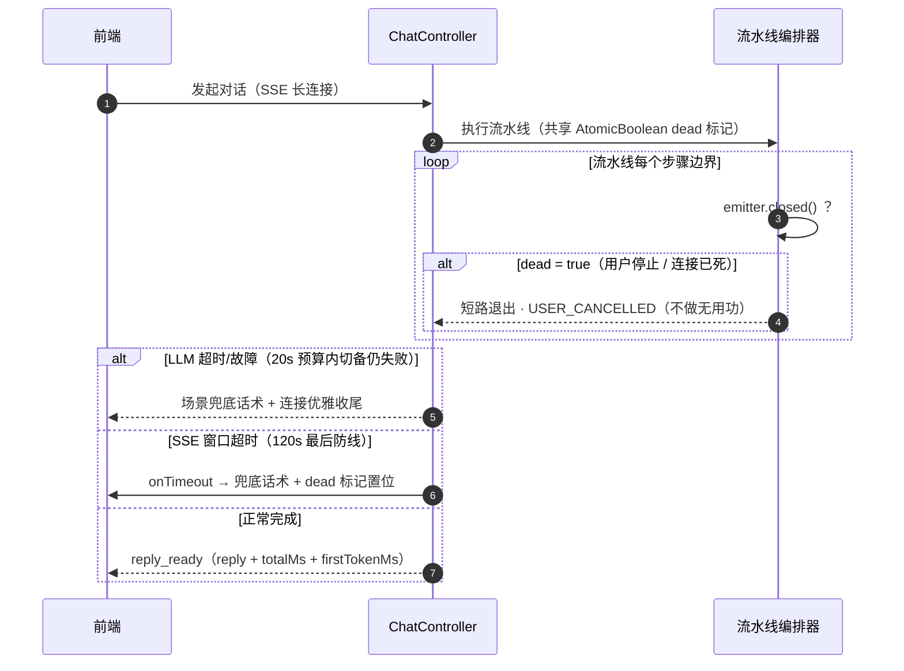
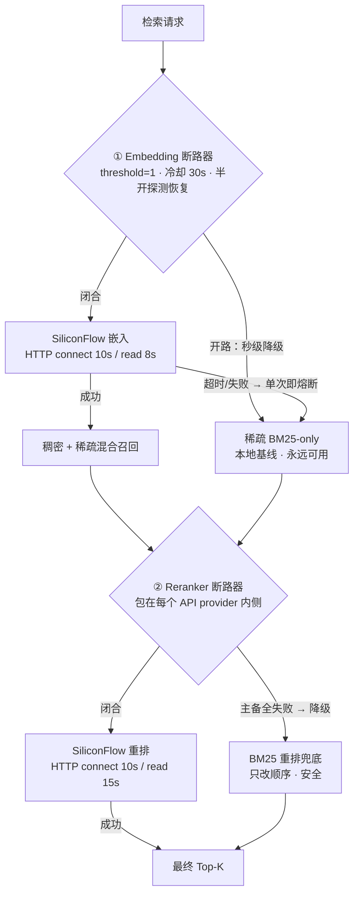

# 从 80.5s 到 6 秒：一个电商客服 Agent 的全链路延迟与稳定性调优实录

> **语言 / Language**：中文 ｜ [English](https://github.com/Gavincui123/Agentdemo007/blob/master/docs/blog/2026-09-16-agent-latency-stability-tuning.en.md) ｜ 系列第八章（[目录](https://blog.csdn.net/qq_24993561/article/details/166257230)）｜ 上一章：[业务工具与售后工作流 DAG](https://blog.csdn.net/qq_24993561/article/details/166257733)
>
> **项目**：Agentdemo007 —— 电商智能客服 Agent
> **技术栈**：Java 17 / Spring Boot 4.1 / LangChain4j 1.19 / LangGraph4j 1.5 / Nacos（配置中心 + 提示词模板）/ Redis / RabbitMQ / Vue3 前端
> **调优周期**：2026-09-15 ~ 2026-09-16
> **验证规模**：948 个测试全绿（0 失败 / 9 个烟测跳过），主代码改动 33 个文件（+812 / -107）
> **源码**：[github.com/Gavincui123/Agentdemo007](https://github.com/Gavincui123/Agentdemo007)

---

## 核心结论（TL;DR）

一轮看似简单的问答背后，是一条「规则分诊 → 意图识别 → 路由决策 → 路由计划 → 工具/RAG → 上下文组装 → 主模型流式输出」的多级流水线。本次调优前，这条流水线暴露出三类问题：**超时后 SSE 连接静默死亡**（致命）、**单轮延迟 60~90 秒且波动剧烈**、**意图/话题漂移**。调优后：

| 指标 | 调优前 | 调优后 |
|---|---|---|
| 简单推理题端到端耗时 | **80.5s**（首字 80.0s，用户全程盯打字点） | **11.9s**（首字 11.5s，冷启动首轮） |
| 典型轮次耗时 | 60~90s 波动，RAG 故障时静默挂 93s | 6.1~11.9s，规则短路径**首字 2.1s** |
| LLM 超时后用户侧表现 | SSE 连接被容器掐断，**无任何消息** | 兜底话术 + 优雅收尾，100% 有响应 |
| 用户点「停止」 | 前端停止，后端继续跑完（僵尸工作） | 流水线步边界协作式取消 |
| 意图识别 | 「帮我开增值税专用票」漂移成**转人工** | 分类稳定，业务请求进业务路径 |
| 多轮话题 | 「我只要耳机推荐」混入上文发票内容 | 新话题独立作答 |
| 会话记忆 | `append` 零调用方，历史从未落库 | 每轮落库 + Redis 缓存 + 摘要锚点 |
| 兜底人格 | 「你是一个严谨、安全的智能助手」（通用助手） | 与 Nacos 人设一致的电商客服 |

核心方法论一句话：**超时要成链路地算、重试要换归属地、每个外部依赖都要有「快速失败 + 本地兜底」、规则层与模型层用候选集硬隔离**。

---

## 一、背景：一轮请求到底发生了什么

先看清楚成本花在哪。用户发一条消息后、主模型出声之前，流水线内部其实先跑了 **3~5 次小模型调用**：



两件事值得注意：

- **规则命中是最快的路**：前置分诊命中时直接跳过 ②~⑤，最终日志里这条路径首字仅 2.1s；
- **⑤ 路由计划是当前最大的方差源**：同类型调用，轮与轮之间从 1.9s 波动到 8.0s。

这意味着**链路里任何一个环节挂住，用户都在干等**——而调优前，几乎每个环节都挂过。

---

## 二、致命问题：LLM 超时后，SSE 连接静默死亡

### 现象

日志里 LLM 超时异常清清楚楚，但前端 SSE 连接直接断掉，**没有返回任何兜底话术**。用户视角：发消息 → 转圈 → 连接死亡，什么都没有。这是本次调优中被判定为「很致命」的问题。

### 根因：超时链路是乘法，不是加法

排查发现超时从来不是单点问题，而是一整条失控的链：

1. **LC4j 默认重试未关**：`OpenAiChatModel` 默认带内部重试，单次 60s 超时 × 多次重试，一个坏请求可以吃掉 180s+；
2. **SSE 异步窗口 120s**：超时后 Tomcat 直接掐断连接，而代码里 `onTimeout` 回调**无人善后**——流水线还在后台跑，「晚到的成功」全部撞死在已关闭的连接上；
3. **网关层同模型重试**叠加：一次超时触发「同模型再试一次」，预算再度翻倍。

### 修复：超时预算治理 + SSE 善后 + 协作式取消

第一刀，**把整条链的超时预算压成一张守恒的表**：

| 层 | 配置 | 值 | 失效去向 |
|---|---|---|---|
| SSE 异步窗口 | `app.sse.timeout-ms` | 120s | `onTimeout` 发兜底话术 + 死亡标记 |
| LLM 单次调用 | `llm.timeout` | **20s**（可配） | 网关立即按候选序切主备 → 场景兜底话术 |
| LC4j 内部重试 | `maxRetries(0)` | 关闭 | 重试权上移网关层 |
| 网关同模型重试 | `RetryPolicy.noRetry()` | 关闭 | 超时/故障**不重试，直接切备** |
| LLM 断路器 | threshold=5 / window 60s / cooldown 30s | — | 开路期请求不再出门 |
| Embedding/Reranker HTTP | connect 10s / read 15s | — | 裸 `new RestTemplate()` 无超时是无限挂起根源 |
| 工具断路器 | threshold=3 / cooldown 30s | — | 工具降级不阻塞 |

20s 的依据写在配置注释里：关思考后各调用实测 0.6~2.8s，20s = 7~30 倍余量；而实测 SiliconFlow 有间歇挂起（改写调用挂 60.8s 后重试 0.7s 即成功）——**阈值越低，单次挂起的损失越小**。

修复后的主备容灾链全景——任何一跳失败都有明确去向，且全程在 SSE 120s 窗口内收口：



第二刀，**SSE 生命周期善后**。三个回调（`onTimeout`/`onError`/`onCompletion`）共享一个 `AtomicBoolean dead` 标记：

- 超时/出错时先给用户发一条 `PIPELINE_TIMEOUT` 兜底话术，再标记死亡；
- `ProgressEmitter` 接口新增 `closed()`，编排器在**每个步骤边界**检查：连接已死 → 记录 `USER_CANCELLED`，流水线短路退出，不再做无用功。

落到代码上——三个回调共享一个 `dead` 标志，超时回调里先补发兜底话术（`web/ChatController.java`）：

```java
String sessionId = resolveSessionId(request);   // 超时兜底话术须回传流水线同款 sessionId
SseEmitter emitter = new SseEmitter(sseTimeoutMs);
// dead 标志：超时/断开/完成后置位，进度桥与终端发送据此静默 no-op（不再撞 already completed 刷屏）
AtomicBoolean dead = new AtomicBoolean(false);
emitter.onTimeout(() -> {
    dead.set(true);
    log.warn("SSE 超时（{}ms），补发超时兜底话术：sessionId={}", sseTimeoutMs, sessionId);
    sendTimeoutFallback(emitter, sessionId);    // 补发 PIPELINE_TIMEOUT 话术 + complete
});
emitter.onError(t -> dead.set(true));
emitter.onCompletion(() -> dead.set(true));
// 工作线程跑 runToSse：控制器立即返回 emitter（Spring MVC async 释放请求线程），真流式 flush
sseTaskExecutor.execute(() -> runToSse(emitter, request, sessionId, dead));
return emitter;
```

SSE 全生命周期与协作式取消的交互时序：



第三刀是顺带的收获：既然有了步边界死亡检查，「停止对话」按钮从前端的假停止变成了**真停止**——用户点停止 → dead 标记置位 → 下一个步骤边界退出，后端日志立刻安静。

### 为什么要 `maxRetries(0)` + 网关 noRetry 双保险

LC4j 的 builder 里 `maxRetries` 只管「同一个模型再试」，而我们的容灾哲学是：**同模型重试大概率重放同一个故障，重试的意义应该由网关层「切备」来承担**。主模型 20s 超时 → 立即切备选模型 → 备选也挂 → 场景兜底话术。三跳全部有预算约束，最坏情况也在 SSE 120s 窗口内收口。

```java
// gateway/llm/LangChain4jModelExecutor.java —— LC4j 内部重试关闭，重试/转移归网关层
OpenAiChatModel.OpenAiChatModelBuilder b = OpenAiChatModel.builder()
        .baseUrl(baseUrl)
        .apiKey(apiKey)
        .modelName(request.modelId())
        .timeout(timeout != null ? timeout : Duration.ofSeconds(60))
        // LC4j 内部盲重试（默认 2 次、不退避、不感知熔断/SSE 预算）关闭——重试/转移归网关层
        // （ResilientExecutor 同模型退避 + FailoverExecutor 主备切换）。实测事故：120s 超时 ×
        // LC4j 3 次尝试把单次逻辑调用放大到 121s+，吃满 SSE 窗口后连接被掐、兜底话术发不出去。
        .maxRetries(0);
```

---

## 三、延迟解剖：80.5 秒的账单是怎么欠下的

### 3.1 最大单笔：思考模式（80.5s → 6.4s）

第一份账单来自推理模型的「思考」。用户问「2加3乘4」，思考模式开启时输出步耗时 35.7s 无首字——Qwen 系推理模型**先吐 `reasoning_content` 再吐正文**，而 SSE 只流正文，用户全程盯着打字点干等。

修复不是删功能，而是**意图驱动的默认值**：闲聊恒关思考；非闲聊默认关（`LLM_THINKING_ENABLED=false`），需要深度推理时环境变量重开，且 `max-tokens` 须同步调大（1024 常令 reasoning 耗尽预算 → 空 content → 被误判为不可用）。

> 实测同一道题：思考开 80.5s → 思考关 6.4s。

### 3.2 最隐蔽的一笔：没有日志的 93 秒

日志里出现过两段 93s 和 64s 的空白——**没有任何 LLM 出站日志**，请求像人间蒸发。根因：RAG 的 embedding 调用用的是裸 `new RestTemplate()`，**连接和读取都无超时**，SiliconFlow 间歇挂起时就被无限拖住。

修复分三层：

1. **HTTP 层**：`SimpleClientHttpRequestFactory` 显式设超时——当时是 connect 10s / read 15s；2026-09-17 回访时把嵌入 read 收紧至 8s（connect 不变），重排维持 10s / 15s（嵌入单条文本正常亚秒级，快降级 BM25-only 胜过长挂起）；
2. **断路器层**：新增 `CircuitBreakerGuard`（threshold=1：单次失败即熔断，30s 冷却后半开探测），包住 embedding 服务和**每一个** reranker API provider。threshold=1 是刻意的——RAG 有永远可用的本地 BM25 稀疏通道，稠密/重排挂了就该秒降级，而不是连试三次；
3. **启动层**：`RagSeedRunner` 种子语料索引改成 try-catch 的尽力而为——之前它抛一次 embedding 超时能把整个 `@SpringBootTest` 上下文带崩，启动路径上不该有任何强外部依赖。

```java
// capability/rag/EmbeddingConfig.java —— HTTP 层 + 断路器层（引用为现行值，09-17 收紧后）
@Bean
RestTemplate embeddingRestTemplate() {
    // 超时预算治理：裸 RestTemplate 无超时（连接/读取无限挂起）——实测 SiliconFlow 故障期
    // RAG 稠密检索被拖 90s+。超时 → FailoverEmbeddingService 切备/降级稀疏-only，不阻塞链路
    org.springframework.http.client.SimpleClientHttpRequestFactory f =
            new org.springframework.http.client.SimpleClientHttpRequestFactory();
    f.setConnectTimeout(10_000);
    f.setReadTimeout(8_000); // 收紧：嵌入单条文本正常亚秒级，快降级 BM25-only（终闸兜底）胜过 15s 挂起
    return new RestTemplate(f);
}

@Bean
EmbeddingService embeddingService(EmbeddingProperties props,
                                  RestTemplate embeddingRestTemplate,
                                  ObjectMapper embeddingObjectMapper) {
    EmbeddingService delegate = buildEmbeddingService(props, embeddingRestTemplate, embeddingObjectMapper);
    // 熔断守卫：provider 故障期首次失败即开断路（冷却 30s 半开探测），查询快速降级稀疏-only，
    // 不再每轮吃满读超时（实测首轮因此 70s）
    CircuitBreakerGuard guard = new CircuitBreakerGuard("embedding", 60_000, 30_000);
    return text -> guard.call(() -> delegate.embed(text));
}
```

RAG 两条降级链全景（embedding 挂 → 秒降级稀疏；reranker 挂 → 降级 BM25）：



这里有个容易踩的坑：断路器一开始包在 `FailoverReranker` **外层**，但 FailoverReranker 内部会把 provider 异常吞掉降级 BM25——外层永远看不到失败，断路器永不跳闸。**断路器必须包在每一个会吞异常的容灾体的内侧**，这是修完才想明白的。

### 3.3 残余大头：路由计划调用 1.9~8.0s

最终验证日志显示，前置小模型调用里**路由计划（RoutePlanStep）单次 7.4~8.0s**，占首字延迟的 65~75%，且波动剧烈（下一轮同环节只要 1.9s）。这是本阶段识别出的下一个优化标的，见「遗留与下一步」。

---

## 四、意图漂移：「帮我开增值税专用票」被劫持成转人工

### 现象

用户要开发票，小模型把意图分到 `TRANSFER_TO_HUMAN`，请求被 HITL（人工介入）步骤劫持，业务请求根本没进业务管线。

### 根因：候选集污染 + 提示词裸奔

两个问题叠加：

1. **候选集把规则层专属意图喂给了模型**。`TRANSFER_TO_HUMAN`、`INJECTION` 本应由关键词规则硬命中，放进模型候选集等于让模型「猜」一个它不该猜的选项；
2. **分类提示词几乎没有工程**：没有任务定义、没有分类原则、没有业务定义、没有示例。换一个模型，输出分布立刻漂移——用户一针见血：「若按照当前情况来看，我切换了模型不至于偏移如此夸张」。

### 修复：候选集收缩 + 结构化分类提示词

候选集只保留模型可选项（CHIT_CHAT / REASONING / LONG_CONTEXT / STRUCTURED_EXTRACTION / OTHER），解析层再做一道防线：模型即便输出了 `TRANSFER_TO_HUMAN`，`parseIntent` 也因意图不可选返回 null → 兜底 UNKNOWN（下游置 OTHER 继续推进），业务问题不会被话术劫持——规则层在模型之前已执行过，不存在"回退规则层"。

```java
// intent/IntentRecognizerImpl.java —— 候选集硬隔离：规则层专属意图不进模型候选
// TRANSFER_TO_HUMAN（用户显式诉求，关键词层 0.95 触发）与 INJECTION（规则层独占，零 LLM）
// 不进模型候选——实测模型把"帮我开增值税专用票"判成转人工 → HitlStep 建工单短路，业务问题被话术劫持（意图漂移）。
private static final Map<Intent, String> MODEL_CANDIDATES = Map.of(
        Intent.CHIT_CHAT, "闲聊：问候、寒暄、情绪表达、与业务无关的闲谈",
        Intent.REASONING, "推理：需要计算、对比、分析、总结或解释因果的问题",
        Intent.LONG_CONTEXT, "长上下文：用户提供大段材料并要求基于材料处理",
        Intent.STRUCTURED_EXTRACTION, "结构化抽取：从用户给定的文本中提取字段或结构化信息",
        Intent.OTHER, "其他：咨询、办理、投诉等业务诉求，且不属于以上任何类别");

/** 模型可否输出该意图：TRANSFER_TO_HUMAN（显式诉求走关键词层）与 INJECTION（规则层独占）除外。 */
private static boolean isModelSelectable(Intent intent) {
    return intent != Intent.TRANSFER_TO_HUMAN && intent != Intent.INJECTION;
}
```

提示词按可迁移的结构重写——一句任务定义 + 五个结构段缺一不可：

```
你是电商客服系统的意图分类器。        ← 任务定义（首句）
## 分类原则          ← 显式诉求优先 / 转人工不在候选 / 不确定选 OTHER
## 候选意图          ← 每个意图一句话业务定义
## 示例              ← 5 组 few-shot，含反例：
   用户：帮我看看怎么开增值税发票 → OTHER
## 输出格式          ← 只输出一行意图名
## 会话背景          ← 最近 6 条对话
```

few-shot 里专门放了「开发票 → OTHER」这条**曾经漂移的反例**——把线上事故变成测试用例，是提示词工程里性价比最高的事。配套测试直接 pin 提示词结构（断言「分类原则/候选意图/示例/输出格式」存在、`TRANSFER_TO_HUMAN` 不在候选），防止后人把提示词改回去。

---

## 五、话题缠绕：「我只要耳机推荐」混入了发票内容

多轮历史是无条件注入 prompt 的，改写器又会把本轮问题「结合上文」改写，于是上一轮的开票内容污染了本轮的耳机推荐。

修复是两道约束：

1. **运行时块新增多轮规则**：`若用户提问开启了新话题，直接回答新话题；仅当问题指代上文（如"它/这个/刚才提到的"）时才结合历史回答`；
2. **改写器划红线**：`必须保留用户原问题原意（不可丢弃/篡改用户原话），只补充必要的上下文（关键词/商品/活动名/时间线）使指代可消解；严禁替用户下业务结论（不得判定订单状态、意图归属或业务决策）`——改写器的职责是消解指代，不是替用户做意图归属。

验证：最终日志第二轮「耳机推荐」独立成答，回复只谈耳机，零上文残留。

---

## 六、会话记忆断裂：一个零调用方的方法

排查发现 `SessionCacheService.append(...)` **在整个主链路里没有任何调用方**——会话历史从未持久化，多轮记忆全靠当次请求的上下文，重启即失忆，跨轮靠运气。

修复：`ChatTurnFinalizer` 在每轮终局统一落库（`chat_turn` 表 + 异步持久化 + Redis 缓存 + 摘要锚点），用户取消的轮次跳过历史追加。同时给 LLM 生成的会话摘要加**垃圾守护**——回显式输出（带 `{}`）或超长（>60 字符）直接丢弃，宁缺毋滥，因为摘要锚点会进后续每轮的 prompt。

```java
// session/summary/LlmSummaryHook.java —— 垃圾摘要会污染整个会话上下文，宁缺毋滥
if (isGarbage(trimmed)) {
    // 锚点要写入 System 提示并喂给后续轮次——垃圾摘要（模型回显提示词碎片/超长跑偏）
    // 会污染整个会话上下文，宁缺毋滥（②降级：无锚点继续推进）
    log.warn("摘要输出疑似垃圾（含花括号或超长），丢弃锚点：len={}", trimmed.length());
    return Optional.empty();
}

/** 垃圾摘要判定：含 '{'/'}'（提示词/JSON 碎片回显）或超过 60 字（一句话概括的正常上界） */
private static boolean isGarbage(String summary) {
    return summary.indexOf('{') >= 0 || summary.indexOf('}') >= 0 || summary.length() > 60;
}
```

最终日志验证了记忆闭环：第二轮 prompt 里完整携带第一轮的问答历史，摘要锚点正确写入（`用户咨询数学计算问题：2加3乘20的结果`）。

---

## 七、兜底人格漂移：兜底不是「降级成通用助手」

代码里写死的默认提示词被逐个盘点，发现 SystemAnchorLayer 的兜底只有一句「你是一个严谨、安全的智能助手」——一旦 Nacos 提示词模板拉取失败，同一个系统会**降级成一个完全不同的人格**，回答风格漂移。

修复原则一句话：**兜底不是降级成通用助手，而是降级成同一个客服**。5 处硬编码提示词全部对齐 Nacos 人设：

| 位置 | 角色 |
|---|---|
| `SystemAnchorLayer.DEFAULT_SYSTEM_PROMPT` | 电商智能客服完整人设（职责/语气/安全边界/格式四段） |
| `QueryRewriter` | 客服系统的**问题改写器** |
| `LlmSummaryHook` | 客服系统的**会话摘要助手** |
| `RoutePromptBuilder` | 客服系统的**路由决策器** |
| `IntentRecognizerImpl` | 客服系统的**意图分类器** |

人设四段结构与 Nacos「AI 提示词模板」里的角色片段逐段对齐，最终日志验证两种来源（Nacos 片段 / 本地兜底）产出的 system prompt 人格一致。

---

## 八、可观测性配套：先能看见，才谈优化

延迟优化能持续推进的前提是每一毫秒都可归因，本阶段补齐了三块：

1. **后端统一计时**：`ChatResponse` 携带 `totalMs`（端到端）与 `firstTokenMs`（首字），首字时间用包装 Emitter 在第一个 TokenChunk 处捕获——前端展示「·耗时 11.9s（首字 11.5s）」；
2. **LLM 出站日志**：每次模型调用记录 `scene / model / durMs / ok / attempt`（如 `LLM出站 scene=回答生成 model=siliconflow-small durMs=7405 ok=true attempt=1/2`），93s 静默挂起这类「无日志空白」从此不可能再发生——空白即线索；
3. **全链路 trace id**：前端每条消息展示 trace，可直接回查后端日志。

---

## 九、效果验证：最终日志逐轮分解

2026-09-16 12:05~12:08 真实联调日志（SiliconFlow 生产端点，同一会话连续 4 轮）：

| 轮 | 用户输入 | 路径 | 前置 LLM 调用 | 用户侧耗时 |
|---|---|---|---|---|
| 1 | 2加3乘20等于多少 | REASONING → large 模型 | 869+1017+854+**7405**ms | 11.9s（首字 11.5s） |
| 2 | 耳机推荐 | OTHER → large + queryProduct 工具 | 728+531+**7962**+944ms | 11.4s（首字 10.6s） |
| 3 | 我要退货×22（压力复读） | **规则分诊命中**，免意图/免路由计划 + RAG 政策×2 | 仅 1214ms | 11.9s（**首字 2.1s**） |
| 4 | 手机壳有推荐吗 | OTHER → large + queryProduct 工具 | 1105+1099+1113+**1946**ms | 6.1s（首字 5.8s） |


这轮验证同时确认了质量侧修复全部生效：

- **零挂起、零超时死亡**：全程无一处 20s+ 空白，SSE 4/4 优雅收尾；
- **话题隔离**：轮 2 干净的耳机推荐，无任何上文残留；
- **抗压输入**：轮 3 的「我要退货」×22 复读，规则层短路径承接，回复正确给出退货政策并附**可追溯引用**（退货政策知识库§3、退款政策知识库§2），首字仅 2.1s——规则命中路径跳过 2~3 次前置 LLM 调用，是整条链最快的路；
- **记忆闭环**：轮 2/3/4 的 prompt 均正确携带历史与摘要锚点；
- **人设一致**：每轮 system prompt 首段均为电商客服人设。

延迟演进全过程：**80.5s → 67.1s → 6.4s（关思考）→ 70.5s（RAG 故障暴露）→ 6.1~11.9s（超时预算 + 断路器收口）**。


> 值得注意的细节：轮 1 与轮 4 同为 4 次前置调用，耗时差近一倍（11.9s vs 6.1s），差异几乎全部来自路由计划那一次小模型调用（7.4s vs 1.9s）。当前延迟已从「我们的代码挂了」变成「上游小模型服务的方差」——这是性质完全不同的两种慢。

---

## 十、经验小结

1. **超时要成链路地算**。LLM 20s × 重试 2 次 + 网关重试 + SSE 120s，任何一处没约束，其他处的精心设计都是摆设。先画预算表，再定每个数字。
2. **重试要换归属地**。框架默认的「同模型重试」重放的是同一个故障；把重试权收归网关层，语义从「再试一次」变成「换一个」。`maxRetries(0)` 不是激进，是把重试花在更可能成功的地方。
3. **每个外部依赖都要有「快速失败 + 本地兜底」**。断路器阈值的选择依据是兜底通道的可用性：embedding 有永远在线的 BM25，threshold=1 秒降级；断路器还要包在容灾体内侧，否则异常被容灾体吞掉、断路器永不跳闸。
4. **规则层与模型层用候选集硬隔离**。「转人工」「注入检测」这类安全语义交给关键词硬命中，不进模型候选；提示词里的 few-shot 要收录线上漂移过的真实反例，并用测试 pin 住提示词结构。
5. **兜底不是降级成另一个产品**。所有降级路径（Nacos 拉取失败、模型超时兜底）都必须落到同一个人设、同一套话术风格上——用户不该感知到系统降级过。
6. **没有日志的延迟是最贵的延迟**。出站日志（模型/耗时/尝试次数）+ 首字耗时统计，是把「感觉慢」变成「知道哪慢」的前提。

---

## 十一、遗留与下一步

| 事项 | 现状 | 方向 |
|---|---|---|
| **前置调用合并** | 每轮 3~5 次小模型前置调用，路由计划单次 1.9~8.0s，是首字延迟最大方差源 | 合并意图识别+路由决策+路由计划为 1~2 次结构化调用，预期首字再降 3~6s |
| **RAG 语料缺口** | 种子语料 6 条，无开票场景；开票类问题检索不到政策 | 补录开票知识片段（后记：第五章语料工程已补录，含 `05-invoice.md`） |
| **双源提示词同步** | Nacos 模板与本地默认值人工保持一致 | 建立两源的 diff 校验或发布脚本 |
| **规则分诊误命中观察** | 轮 3 压力复读命中了分诊规则（结果正确但路径值得观察） | 积累误命中样本，校准规则置信度 |

---

*本文所有数据均来自生产端点真实联调日志与 948 个自动化测试的回归结果；代码位于 Agentdemo007 仓库 `develop` 分支。*

> 相关阅读：[系列目录](https://blog.csdn.net/qq_24993561/article/details/166257230) · [第三章·模型网关与韧性治理（`maxRetries(0)` 的归属地）](https://blog.csdn.net/qq_24993561/article/details/166257763) · [下一章：评测体系](https://blog.csdn.net/qq_24993561/article/details/166257751)
