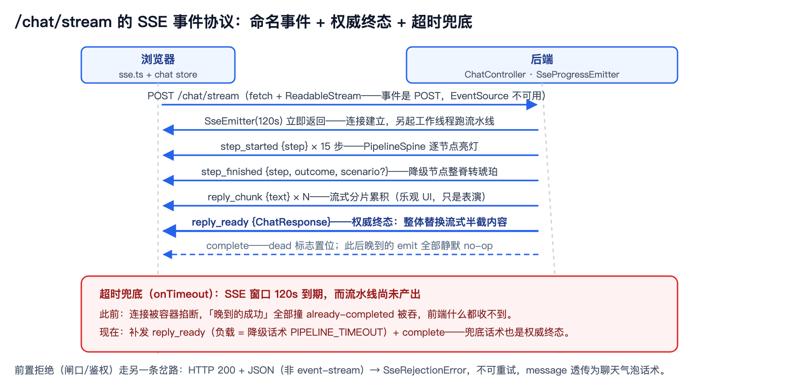
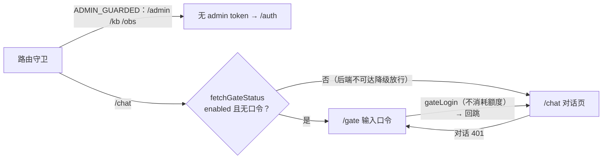

# 前端与流式交互：单 jar 里的 SPA 与一套手撸 SSE 协议

> **语言 / Language**：中文 ｜ 系列第十章（[目录](https://blog.csdn.net/qq_24993561/article/details/166257230)）｜ 上一章：[评测体系](https://blog.csdn.net/qq_24993561/article/details/166257751) ｜ 下一章：[可观测性与审计](https://blog.csdn.net/qq_24993561/article/details/166257770)
>
> **项目**：Agentdemo007 —— 电商智能客服 Agent
> **技术栈**：Vue 3.5 / Vite 8 / Pinia / TypeScript 6 / vitest 3（构建产物直出后端 jar）
> **周期**：2026-09-03 前端设计 spec → 09-14 P0 意图切换与流式事件 → 09-18 闸口/登录前置
> **验证规模**：sse.test.ts 264 行（27 例）钉死解析器与消费器语义；chat store / api 层 vitest 覆盖
> **源码**：[github.com/Gavincui123/Agentdemo007](https://github.com/Gavincui123/Agentdemo007)

---

## 核心结论

前端在我这里从来不是"配一个聊天页面"，而是后端每条纪律在浏览器里的镜像：HTTP 200 的口径、降级标签、权威终态、协作取消，每一项都能在前端找到对应实现。这一章讲三件事：SPA 为什么住进后端的 jar 里、SSE 协议为什么手撸以及为此付过的一次 P0（最高优先级缺陷）学费、会话状态机怎么保证用户永远看不到"缝合怪"回答。

## 一、单 jar 里的 SPA：两个决策

写前端之前，部署形态已经定了：单 jar，一进程即整站。这个前提倒推出两个前端决策。

第一个，构建产物直出后端 `classpath:/static/`——`vite.config.ts` 的注释把理由写得很直白：生产构建打进 jar，由后端 @Controller 加静态资源同源服务，不再需要独立的前端服务器。

第二个，路由用 hash 模式。history 模式当然更"现代"，但它把 SPA fallback 的责任推给服务端——单 jar 形态下，后端要为所有未命中的路径兜底返回 index.html，这会跟 `/chat`、`/admin/*`、`/eval/run` 这些 API 路由表打架。hash 不发往服务端，导航路径和 API 路径天然零冲突，dev 代理和生产单 jar 两种形态都不需要 fallback。一个 URL 里的 `#`，换掉了整类部署问题；代价是对 SEO 不友好——对一个作品集演示站，这个代价不存在。

还有一行注释值得单独抄下来，是 dev 代理配置里的：`/chat` 代理项注明"SSE (text/event-stream) 不可缓冲：关代理压缩、保流式"。代理缓冲是流式的第一杀手，nginx 侧的同款战斗在第十二章——同一类问题在链路上会出现两次，一次在 dev 代理，一次在生产网关。

## 二、为什么手撸 SSE：EventSource 天生不够

决定自己实现 SSE 客户端，不是喜欢造轮子，是原生 EventSource 有一个过不去的硬伤：

```ts
// utils/sse.ts 文件头 —— 为什么不用原生 EventSource
// 后端 /chat/stream 为 POST（原生 EventSource 仅 GET 无法 POST），
// 故采用 fetch + ReadableStream 流式读取 + 本解析器切分 data: 事件。
// 本模块仅含纯函数（无网络/无时钟副作用）。
```

后端的对话接口是 POST（要带请求体），EventSource 只支持 GET，这条路从浏览器标准层面就是死的。fetch 加 ReadableStream 自己读流，顺便带来一个意外的好处：解析可以做成纯函数，离线测试，不用起服务器。

所以解析器是三件套纯函数：`splitSseStream` 归一 CRLF、按空行切事件；`extractSseData` 拼接多条 `data:` 行、剥**恰好一个**前导空格——SSE 规范就是这么写的，两个空格只剥一个，这里有专测钉着；`extractSseEventName` 抽事件名；`:` 开头的注释行跳过。网络、重试这些有副作用的活全在消费器 `streamChat` 里，跟解析彻底分开。

消费器里有个容易被忽略的分支：**前置拒绝不可重试**。HTTP 200 返回 JSON（而不是 event-stream）是闸口或鉴权在对话入口的拒绝——`SseRejectionError` 的 message 就是后端面向用户的那句话术，注释里明说：

> "不可重试（重试也不会变）……由调用方透传气泡"

重试只留给网络类失败：退避 base 500ms 按两次方涨，封顶 8 秒，确定性间隔、无抖动。

## 三、一次真实事故：事件名被 parse 层扔掉

P0 可观测联调的时候，我碰到一个很典型的"静默失效"：后端明明在发命名事件（`step_started/step_finished/reply_chunk/reply_ready`），前端的进度条纹却丝纹不动，流式 token 也一个都看不到。没有报错，没有异常，功能就是蒸发。修复提交里的注释原文记录了根因（`sse.ts`）：

> P0 可观测：后端 /chat/stream 用命名事件（step_started/step_finished/reply_chunk/reply_ready），前端此前只抽 data 丢弃事件名——**逐步进度与流式 token 因此全被 parse 层扔掉**。

我的解析器只实现了 SSE 规范的 data 通道，没实现 event 通道——事件名在 parse 层被丢弃，而且丢弃得悄无声息。这个事故给我两层教训。第一，**协议的两端要有一份共同的事件名清单**：发送侧的 `SseProgressEmitter` 映射 step_started/step_finished/reply_chunk，`ChatController` 终端发 reply_ready，两端用同一套名字，任何一侧单独改名都会在测试里炸出来。

第二，**parse 层丢信息是静默的**——它不算错误，只是功能消失，这类问题靠异常监控抓不到，只能靠端到端联调或协议测试暴露。

## 四、用测试钉住协议：sse.test.ts 的五组关键语义

264 行的测试文件（7 组 describe、27 例）把 SSE 客户端语义逐条钉死。挑五组关键的：

| 语义 | 断言要点 |
|---|---|
| 切分与残留 | 跨 read 重组：`['data:hel','lo\n\n','data:world\n\n']` → hello/world；CRLF 归一 |
| 空格剥离 | "strips exactly one leading space"——两个空格只剥一个 |
| 重试与中止 | 500 耗尽 → onError(willRetry=false)；中止 → 只 onClose（"退避期间立即唤醒"是实现行为——`delay()` 被中止即 resolve，非测试断言） |
| 命名事件 | onEvent 优先通道、onMessage 不再投递；无名事件缺省 'message' |
| 前置拒绝 | `{code:429, message:'今日体验轮次已用完，欢迎明天再来'}` → fetch 恰 1 次、onOpen/onEvent 不触发、话术**逐字**断言 |

最后一组最有意思：后端改一句话术，前端测试直接打红。这是故意的——**话术在这套系统里是契约，不是文案**，契约的变更就该有仪式感。



## 五、会话状态机：乐观占位、权威终态、重试清场

流式会话的状态收口就三条规则，`stores/chat.ts` 里写成了代码注释：

```ts
// stores/chat.ts —— 流式会话的收口三规则（简化示意；源码注释逐字保留）
sendStream() {
  // ① 乐观占位：先 push user 消息 + 空内容 assistant 占位
}
onChunk(text) {
  this.m.content += text            // ② 流式分片累积
}
onTurn(res) {
  // 终态完整回复为权威口径：整体替换流式半截内容
  this.m.content = res.reply
}
onError(err, willRetry) {
  if (willRetry) {
    // 退避重试将重开整条流：清掉半截 token 与步骤轨迹，避免跨 attempt 拼接
    this.m.content = ''; this.steps = []
    return
  }
  if (!gotTurn) {
    // 闸口/鉴权拒绝（SseRejectionError）透传后端话术；其余网络错误用通用兜底
    this.m.content = err?.message || FALLBACK
  }
}
```

非重试的错误再分两路：还没收到终态（`gotTurn=false`）就把 `err.message` 或通用兜底话术写进气泡、置 `degraded`，已渲染的占位不清；已经收到终态就什么都不动，权威回复保留。

三条规则里最关键的是整体替换：**流式分片只是"正在打字"的表演，`reply_ready` 的完整回复才是权威口径**。没有这一步整体替换，任何分片丢失或乱序都会给用户留下残缺的回答；有了它，分片通道可以大胆做 best-effort——`api/chat.ts` 的注释写明"未知事件名/载荷形状不符→静默丢弃（进度 best-effort）"。

后端的降级口径在前端长这样：HTTP 200 加 code（`api/http.ts` 注释："后端始终 HTTP 200（含话术短路/降级，①②不暴露技术码），逻辑结果在 code：0=成功，非 0=逻辑错误"）；`degraded:true` 的消息气泡带琥珀边框和"降级·系统仍答"标签——系统还答了，这个事实要在界面上诚实地说出来。

## 六、视图三件套与 citations 的诚实

本节过一遍四处界面落点——流水线脊、引用标签、评测页、可观测页，每处都是一条后端纪律的镜像。

**PipelineSpine（流水线脊）**把七层架构直接做成了 UI——这是 Agentdemo007 真实的请求处理流，不是装饰。`step_finished` 事件驱动它逐节点亮灯：活跃节点磷光青，降级态整脊转琥珀，"健康实时"和"系统仍答"两种核心态在一条脊柱上分得清清楚楚。

**citations 标签**上，我写了一句跟 RAG 红队实验（第五章）直接相关的话："参考来源 · 可追溯不等于绝对正确"。红队证明过，语义相关的错误知识能穿过检索闸门直通大模型——那么引用来源的标签就不能暗示"有出处即正确"，产品文案得对工程结论诚实。

**EvalView** 用 1 秒轮询 `GET /eval/progress`，遇到 409 就"自动接上正在跑的进度（页面刷新后同样可续看）"，单次轮询失败静默等下一轮——这是第九章评测异步化的前端侧。**ObservabilityView** 消费 `GET /api/obs/summary` 的 16 个字段，亮灯口径旁边留了专门注释："totalTurns 走异步落库（MQ→MySQL）有滞后——只看 chatRequests/totalTurns 会误判'尚无流量'"——不了解数据链路的指标口径，会得出完全错误的结论。

身份切换器（游客 V0 到 10086 的 V5）是演示的灵魂：`stores/identity.ts` 定义 6 个演示身份，切身份时 `store.clear()` 清空会话——注释原话是"旧会话历史可能含高等级档知识答案，携带进低等级会话会污染演示观感"。权限纪律连演示细节都没放过。

## 七、三重前端闸口与常驻登录

三重闸口＝路由守卫、对话入口口令、401 自动回跳；登录入口常驻可见。



三份凭证两类去处：访问口令与 admin token 各占一个 `localStorage` 键（前者轮换后旧值自然失效——401 自动回登录页），eval token 只在视图内输入、经请求头出站，不落浏览器存储，权威值在后端配置。登录入口的位置有一个明确的产品裁决，写在 ChatView 注释里：

> 2026-09-18 用户裁决：发布为简历项目，登录入口前置可见，不再只靠 401 被动跳转。

路由守卫还留了一手：后端不可达时不拦、降级放行，因为 AccessGateFilter 仍在对话入口兜底。**前端守卫是体验优化，后端过滤器才是安全边界**——两道闸的职责分工，代码注释里就写死了，从不混淆。

## 八、这一章带走的五条

1. **hash 路由 + 产物进 jar 是被部署形态倒推的决策**：单 jar 里 SPA fallback 的麻烦，比 hash 的 URL 难看值钱。
2. **协议解析器要纯函数化**：SSE 语义（空格、残留、注释、事件名）全部离线可测，网络壳单独测。
3. **流式是表演，终态是权威**：乐观占位、分片累积、整体替换、重试清场——四步缺一都会有"缝合怪回答"。
4. **话术即契约**：前端逐字断言后端话术，改文案会打红测试——这是故意的。
5. **前端守卫是体验，后端过滤器是安全**：降级放行的注释把这条边界写在了代码里。

## 九、已知边界（诚实清单）

1. **ECharts 体积**：ObservabilityView 懒加载 chunk ~1MB（"全量 ECharts 打入该懒加载块……后续可改按需 import 瘦身"，DEPLOY.md 构建 chunk 清单登记）。
2. **EventSource 降级轮询只是预案**：代理缓冲导致 SSE 失效时的降级方案在计划文档里登记，未实现——当前靠 nginx `proxy_buffering off`（第十二章）。
3. **身份即 mock**：6 个演示身份由客户端声明，真鉴权接入后收口（第一章诚实清单同条）。
4. **口令存 localStorage**：演示站可接受的安全预算；token 类凭证的生产化要换 HttpOnly Cookie 体系。

---

*本文机制出处：`frontend/src/utils/sse.ts` + `sse.test.ts`、`frontend/src/stores/chat.ts` / `identity.ts`、`frontend/src/api/{chat,http,gate,auth}.ts`、`frontend/src/views/{chat,eval,observability,auth,gate}/`、`frontend/vite.config.ts`；发送侧协议见 `web/SseProgressEmitter`。*

> 相关阅读：[系列目录](https://blog.csdn.net/qq_24993561/article/details/166257230) · [上一章：评测体系](https://blog.csdn.net/qq_24993561/article/details/166257751) · [下一章：可观测性与审计](https://blog.csdn.net/qq_24993561/article/details/166257770) · [第十二章·nginx 侧的 SSE 缓冲治理](https://blog.csdn.net/qq_24993561/article/details/166257739)
