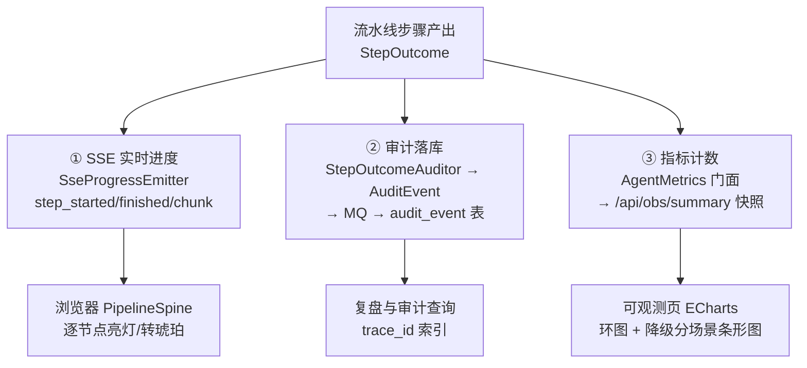

# 可观测性与审计：三条信道、append-only 与「空白即线索」

> **语言 / Language**：中文 ｜ 系列第十一章（[目录](https://blog.csdn.net/qq_24993561/article/details/166257230)）｜ 上一章：[前端与流式交互](https://blog.csdn.net/qq_24993561/article/details/166257757) ｜ 下一章：[部署交付实录](https://blog.csdn.net/qq_24993561/article/details/166257739)
>
> **项目**：Agentdemo007 —— 电商智能客服 Agent
> **技术栈**：Java 17 / trace（MDC+JSON 日志）/ audit（append-only 事件链）/ Micrometer（进程内指标）/ SSE progress（实时进度）
> **周期**：随各 Phase 埋点 → 09-16 延迟攻坚补出站日志 → 09-18 管理台与闸口 → 09-20 提交制收口
> **验证规模**：StepOutcomeAuditor/AuditEventType/AgentMetrics 单测钉死口径；SseProgressEmitter 序列化形状与发送容错测试
> **源码**：[github.com/Gavincui123/Agentdemo007](https://github.com/Gavincui123/Agentdemo007)

---

## 核心结论（TL;DR）

可观测不是"多打点日志"，是**三条语义正交的信道**加一条纪律：任何"没有日志的空白"本身就是线索。

| 信道 | 载体 | 消费者 | 关键纪律 |
|---|---|---|---|
| trace（链路标识） | MDC traceId → JSON 日志 → 响应头 `x-trace-id` | 排查的人 | 生成或透传，贯穿 HTTP→异常→日志→前端气泡 |
| audit（业务事件） | `AuditEvent` append-only，异步落 `audit_event` 表 | 审计与复盘 | 只增不改；Proceed/Retry 不产生审计 |
| progress（实时进度） | SSE `step_started/step_finished/reply_chunk/reply_ready` | 浏览器 | 与审计信道正交，同一 step 产出各自出口 |
| metrics（指标快照） | `AgentMetrics` 门面 → `/api/obs/summary` | 可观测页 | 只经门面打点，防命名/标签漂移 |

---

## 一、traceId 一条线：从过滤器到浏览器气泡

`trace/TraceFilter`（HIGHEST_PRECEDENCE）的 javadoc 把整条线说完了：

> 生成或透传入站 X-Trace-Id，写入 MDC（键 traceId）供 UnifiedResponse 取用，并在响应头回写。traceId 贯穿 HTTP → 异常处理器 → 日志（logback %X{traceId}）全链路。

生产日志是 JSON 结构化的，`"traceId":"%X{traceId}"` 是每个事件的固定字段；响应头 `x-trace-id` 把它交到前端，最终出现在每条消息气泡的 meta 区——**用户反馈"这条回答不对"时，traceId 直接定位到服务端日志行**。跨进程也不断：MQ 消费用 `MdcTraceContextPropagator` 合成 W3C traceparent 注入消息属性，消费线程还原回 MDC（注释预留了 prod 换 OTel 原生实现的位置）。

## 二、append-only 审计链：13 种事件与单一映射源

审计事件的类型全集（`AuditEventType`，13 值，注释节选）：

| 类型 | 语义 |
|---|---|
| INJECTION | 接入层提示注入检测命中（零 LLM 短路） |
| TOOL_CALL / TOOL_FAILURE | 工具调用留痕 / 自纠正耗尽短路 |
| HITL | 转人工/超时/权限不足（工单状态流转） |
| FAILOVER / MODEL_DOWN / FAILOVER_EXHAUSTED | 模型故障转移三态 |
| SESSION_DOWN / RAG_SKIP / OUTPUT_FALLBACK | 各层降级 |
| REFUSAL | 无依据拒答——**"业务级拒答非降级"** |
| DEGRADATION | 通用降级留痕 |
| EXCEPTION | 未预期异常收口到 INTERNAL 话术 |

三条收口纪律让这条链可信：

1. **append-only**："枚举名（name()）稳定……事件只增不改"。
2. **单一映射源**：`AuditEventType.from(scenario)` 把 16 个降级场景映射到审计类型——"避免各处自行 if/else 漂移"。
3. **Per-step 自动收口**：`StepOutcomeAuditor` 统一决定"要不要产生审计"——"Proceed/Retry 无审计（推进/重试，非降级）；ShortCircuit 审计 + 由调用方收口话术；Degrade 审计 + markDegraded"。业务代码不手写审计分支，遗漏在结构上不可能。

```java
// common/pipeline/StepOutcomeAuditor.java —— per-step 审计收口
// Proceed/Retry 无审计（推进/重试，非降级）
// ShortCircuit → 审计 + 话术收口；Degrade → 审计 + markDegraded
// detail 前缀 "短路:"/"降级:"/"异常:" + stepName + scenario/message
```

## 三、SSE progress 协议：给浏览器看的第三条信道

事件时序（发送侧 `SseProgressEmitter`）：连接建立 → `step_started{step}` → `step_finished{step, outcome, scenario?}` ×15 → `reply_chunk{text}` ×N → `reply_ready{ChatResponse}` → complete。序列化异常兜底为 `{}`（坏事件不炸流）；`dead` 标志置位后 emit 静默 no-op——注释原话："此前每个事件撞 'already completed' 各刷一条 WARN，超时后流水线继续推进时刷屏；现在只记 debug"。

与审计信道的关系一句收口："与 StepOutcomeAuditor（审计落库信道）正交：本桥只走 SSE 实时进度信道，**两条信道同一 step 产出各自出口**"——实时性给浏览器，可追溯性给数据库，谁也不替代谁。

超时兜底是这个协议的闭环（`ChatController` 注释原文）：

> 此前超时后连接被容器掐断，流水线『晚到的成功』全部撞 already-completed 被吞，前端什么都收不到。现在 chatStream 注册 SseEmitter.onTimeout：超时即向客户端补发 reply_ready（负载 = ChatResponse 降级话术 PIPELINE_TIMEOUT）+ complete。

另外两处小埋点都值得记：`logArrival` 到达打点（注释原文："此前首条日志=查询改写 LLM 完成（晚 0.8~2.6s），"发起会话→首条日志"的延迟无法区分传输段与管线段——本行把到达时刻显式落日志"）；`FirstTokenTimingEmitter` 在首个 TokenChunk 到达时记首字毫秒——"口径与用户体感一致（打字指示消失、文字开始出现的时刻）"。

## 四、93s 静默挂起：空白即线索

可观测性最贵的一课来自延迟攻坚期（[第八章](https://blog.csdn.net/qq_24993561/article/details/166257713)的完整叙事）：

> 日志里出现过两段 93s 和 64s 的空白——没有任何 LLM 出站日志，请求像人间蒸发。根因：RAG 的 embedding 调用用的是裸 `new RestTemplate()`，连接和读取都无超时，SiliconFlow 间歇挂起时就被无限拖住。

修复后每次模型调用都有出站行：`LLM出站 scene=回答生成 model=siliconflow-small durMs=7405 ok=true attempt=1/2`。而且**流式路径后来又漏了一次**——同步路径有出站日志，流式不经 `FailoverExecutor`，是零日志的（[第三章](https://blog.csdn.net/qq_24993561/article/details/166257763)的补漏记录）。纪律因此定型一句话：**"无日志空白"从此不可能再发生——空白即线索**。观测覆盖不是一次性的，新路径（流式、旁路、批处理）每次都要重新回答"这条路径上日志空白意味着什么"。

## 五、降级语义正交性：什么算"系统坏了"

16 个 `DegradationScenario` 每个都带面向用户话术（INJECTION/BAD_REQUEST/PAYLOAD_TOO_LARGE/RATE_LIMITED/SESSION_DOWN/MODEL_DOWN/FAILOVER_EXHAUSTED/UNKNOWN_INTENT/TOOL_FAILURE/RAG_SKIP/HITL_TIMEOUT/WORKFLOW_APPROVAL_TIMEOUT/OUTPUT_FALLBACK/PIPELINE_TIMEOUT/USER_CANCELLED/INTERNAL）。但统计口径上三条语义必须正交：

- **拒答不标 degraded**（`RefusalGateStep`）："不标记 degraded（与降级语义正交）"——拒答是业务级正确行为，混进降级统计会让故障率虚高。
- **业务驳回不是降级**（`AfterSaleWorkflowOutcome`）："≠ DegradationScenario——业务驳回≠系统失败（E1）：不 ShortCircuit，走 presetReply 短路"。
- **退役场景保留常量**：`WORKFLOW_APPROVAL_TIMEOUT` 注释——"提交制（2026-09-20）后工作流步不再产出本场景（审批是事件，无请求内等待/超时）；常量保留作对外指标兼容"。枚举即对外契约，删名字比留空转更贵。

这三条合起来是同一个原则：**监控里的每个数字都应该能被一句业务语言解释**——"系统故障率"里混进"用户没登录""政策没查到""这单不符合退款条件"，数字就再也不可信了。

## 六、管理台闭环：审批是状态的，不是请求的

`admin/AdminHitlController` 四个端点：`GET /admin/hitl/tickets`（列表，"PENDING 优先，已决议单留痕带徽章；内存+DB 持久副本合并，重启不丢历史"）、`/{id}/confirm`、`/{id}/reject`、`/{id}/resume`（显式恢复接口，APPROVED 单重驱）。两个安全细节：

- **业务前置校验**："confirm 放行前经 HitlBusinessGate 对账订单真实状态……不满足则不决议（工单保持 PENDING），返回 CONFLICT(409)"——[第七章](https://blog.csdn.net/qq_24993561/article/details/166257733)的 mock↔DB 对账事故就是这条链上炸出来的。
- **鉴权同形话术**：`AdminAuthInterceptor` 逐字比对 `X-Admin-Token`，"未授权……同形 HTTP 200 + code 体内表达（①话术短路：不抛 5xx、不进下游控制器）"——闸口语义与管理台语义一致。

指标侧收口在 `AgentMetrics` 门面："所有指标只经此门面记录——同 StepOutcomeAuditor 之于审计，禁止各处散落 MeterRegistry 直接打点导致命名/标签漂移"；`/api/obs/summary` 16 字段快照端点"不缓存、不持久化……空指标→0（②每步降级：端点恒可用，不抛）"。

## 七、可观测三流：一次 step 产出，三个出口




三条信道语义正交的验收方式：关掉任意一条，其余两条照常工作——审计不依赖页面开着，指标不依赖有人看，进度不依赖落库成功。

## 八、经验小结

1. **traceId 要走到用户手里**：响应头 → 气泡 meta，用户报障自带定位符，比"请描述一下什么时候出的问题"快一个数量级。
2. **审计靠结构不靠自觉**：per-step 收口器决定谁产生审计，业务代码没有"忘记埋点"这个失败模式。
3. **信道的正交性要显式声明**：实时进度/审计落库/指标计数三条注释里都写了"与 XX 正交"——不声明，后来者一定会合并它们。
4. **空白即线索**：每条新路径上线前回答"这条路径上没有日志意味着什么"。
5. **正交语义是监控可信的前提**：拒答、业务驳回、退役场景各归各位，故障率才是一个能报警的数字。

## 九、已知边界（诚实清单）

1. **无 Prometheus 后端**：dev 是 SimpleMeterRegistry 内存计数——application.yml 的 exposure 虽列了 `prometheus` 抓取端，但未引入 `micrometer-registry-prometheus` 依赖，该端点实际并未装配；指标是"进程累计当下值"，重启清零。
2. **告警通道 NO_OP**：`AlertChannel` dev 丢弃、"prod 覆盖为 Webhook/邮件/PagerDuty/IM"——未实现；`AlertRuleEvaluator` 只消费快照 Map，"评估器对来源无感"。
3. **无 OTel**：MDC 桥是自研默认实现，注释预留 prod 覆盖点；无分布式 span 树。
4. **指标有滞后陷阱**：totalTurns 走异步落库，可观测页已加口径注释防误读。
5. **密钥启动校验类不存在**——与 DEPLOY.md"已知缺口"对账；双源提示词人工同步登记在第二章与[第十二章](https://blog.csdn.net/qq_24993561/article/details/166257739)的已知边界。

---

*本文机制出处：`trace/TraceFilter`、`observability/`（audit/AgentMetrics/ObservabilityController/alert/）、`common/pipeline/StepOutcomeAuditor`、`common/progress/ProgressEvent`、`web/SseProgressEmitter` + `ChatController`、`admin/AdminHitlController` + `AdminAuthInterceptor`、`logback-spring.xml`。*

> 相关阅读：[系列目录](https://blog.csdn.net/qq_24993561/article/details/166257230) · [上一章：前端与流式交互](https://blog.csdn.net/qq_24993561/article/details/166257757) · [下一章：部署交付实录](https://blog.csdn.net/qq_24993561/article/details/166257739) · [第三章·流式出站日志补漏](https://blog.csdn.net/qq_24993561/article/details/166257763)
