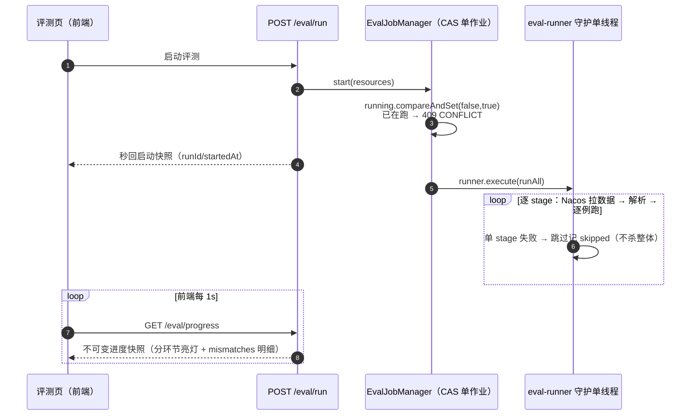

# 评测体系：给评测做评测——hollow eval 事故、异步化与「全绿 ≠ 无缺陷」

> **语言 / Language**：中文 ｜ 系列第九章（[目录](https://blog.csdn.net/qq_24993561/article/details/166257230)）｜ 上一章：[全链路延迟与稳定性调优](https://blog.csdn.net/qq_24993561/article/details/166257713)
>
> **项目**：Agentdemo007 —— 电商智能客服 Agent
> **技术栈**：Java 17 / Spring Boot / 自研 eval 包（黄金集 + 强类型断言 + 异步作业）+ Nacos（黄金集托管）/ Vue3 评测页
> **周期**：Phase 15（评测基座）→ 2026-09-17（Nacos 双源）→ 09-18（异步化）→ Phase 20 T92（hollow eval 修复）
> **验证规模**：默认套件 9 个 stage 63 例全量加载断言（`GoldenSuiteTest`）；eval 包 38 例单测
> **源码**：[github.com/Gavincui123/Agentdemo007](https://github.com/Gavincui123/Agentdemo007)

---

## 核心结论（TL;DR）

评测体系最容易死在两个地方：**断言是空的**（测了但什么都没测），和**评测本身把系统拖垮**（同步跑全量真 LLM）。这两件事我们都真实发生过：

| 问题 | 根因 | 修复 |
|---|---|---|
| hollow eval：字段全绿但从未被对照 | eval JSON 的扩展字段被 `FAIL_ON_UNKNOWN_PROPERTIES=false` 静默丢弃 | `EvalExpected` 扩 13 参强类型 + `checkContains` 对照逻辑 + 4 单测 |
| 全量评测拖爆前端（axios 30s 超时） | HTTP 请求里同步跑逐例真 LLM、无进度 | `POST /eval/run` 秒回作业 + `/eval/progress` 每秒轮询亮灯 |
| 改黄金集要重启 | 数据编译进 classpath | Nacos `agentdemo-eval-<stage>.json` 实时拉取，失败回退本地 |
| 熔断语义无法进 eval | OPEN 是跨请求累积状态，eval 一请求一断言 | 诚实登记：单测覆盖，不硬塞进黄金集 |
| "全绿"被当成"无缺陷" | 评测只断言测过的行为 | 交付报告 §7 缺陷清单：全绿与无缺陷分开陈述 |

---

## 一、黄金集长什么样

评测的基本单位是「stage → case → expected」：每个 stage 一个 JSON（意图、路由、降级、注入、RAG、HITL、审计……），每例声明输入与**强类型**的期望断言集——不是 `Map<String, Object>`，是 13 参的 record，字段名就是契约：


```java
// eval/EvalExpected.java —— 期望断言强类型收口（非 Map）
public record EvalExpected(String scenario, String intent, String route, String selectedModel,
                           Boolean degraded, String outcome, Boolean blocked,
                           Boolean zeroLlm, Boolean shortCircuit, Boolean escalatedToModel,
                           String queryEnrichmentContains, String ragFragmentsContain, Boolean hasFragments) {
    /** 既有 10 参构造（Phase 15 调用方零改动；新字段缺省 null 不参与比较）。 */
    public EvalExpected(…) { … }
}
```

运行时执行器把流水线实际产出收口成 `ActualOutcome`（含派生字段），逐字段对照产出 mismatches 明细。设计上有意让**期望与实际两侧都是强类型**：新增断言维度 = 加字段 + 加对照逻辑 + 加测试，编译器逼着你把新维度接完，不存在"JSON 里写了个字段但没人读"的幻觉——理论上不存在。下一节就是幻觉真实发生的故事。

## 二、hollow eval：一次「全绿但什么都没测」的事故

Phase 20 检索增强做完，评审时发现了一个让整个评测体系蒙羞的事实：**早期的 `EvalExpected` 设计里就有 `standardQueryContains` / `hasFragments` / `summaryTriggered` 这些字段，JSON 里也写了——但 record 上没有这些参数**。Jackson 反序列化配了 `FAIL_ON_UNKNOWN_PROPERTIES=false`（为了容忍 JSON 里的 context 前置条件字段），于是这些字段被**静默丢弃**：

> 发现既有 `EvalExpected` 的 `standardQueryContains`/`hasFragments`/`summaryTriggered` 字段被 `FAIL_ON_UNKNOWN_PROPERTIES=false` 静默丢弃——**文档字段从未被对照**（hollow eval）。——开发计划 T92 注记

也就是说：黄金集里写着"期望 standardQuery 含‘Q3 销售’"、"期望有 RAG 片段"，评测一直全绿——**因为断言从未执行**。宽容的反序列化配置 + 弱类型 JSON 期望，共同制造了"看起来在测"的空转。

修复分三步，全部围绕"让文档字段变成编译期契约"：

1. `EvalExpected` 10 参 → 13 参，新增 `queryEnrichmentContains` / `ragFragmentsContain` / `hasFragments`（10 参次级构造保留既有调用方零改动）；
2. `ActualOutcome` 增 3 个派生字段（从 `PipelineContext` 实际产出派生）；
3. `compare` 增两个对照算子，并配 4 例单测钉死对照逻辑本身：

```java
// eval/EvalExecutor.java —— Phase 20（T92）：新断言维度的对照算子
// Phase 20（T92）：约束改写补全槽 + RAG 片段（含时效标注）
checkContains(mismatches, "queryEnrichmentContains",
        expected.queryEnrichmentContains(), actual.queryEnrichmentKeywords());
checkAnyContains(mismatches, "ragFragmentsContain",
        expected.ragFragmentsContain(), actual.ragFragments());
checkBoolean(mismatches, "hasFragments", expected.hasFragments(), actual.hasFragments());

/** 期望某精确词在补全槽关键词列表中（T88 约束改写补全）。 */
private void checkContains(List<String> mismatches, String field, String expected, List<String> actual) {
    if (expected != null && !actual.contains(expected)) {
        mismatches.add(field + ": expected~contains=" + expected + " actual=" + actual);
    }
}

/** 期望某文本子串在任一 ragFragments 元素中（T89 Hybrid 命中 / T90 时效标注）。 */
private void checkAnyContains(List<String> mismatches, String field, String expected, List<String> actual) {
    if (expected != null && actual.stream().noneMatch(f -> f != null && f.contains(expected))) {
        mismatches.add(field + ": expected~anyContains=" + expected + " actual=" + actual);
    }
}
```

诚实登记的残余盲区：`escalatedToModel`（是否上交小模型仲裁）**不可从实际产出派生，跳过比较**——它被记录为已知限制而不是假装能测。hollow eval 的教训浓缩成一条：**评测断言的"存在"必须在类型系统里可验证，JSON 字段 + 宽容反序列化 = 自欺欺人的温床。**

## 三、同步评测拖爆 HTTP：异步化

评测要跑真实流水线（每例真实 LLM 调用），最初实现是 HTTP 请求里同步跑全量——结果：前端 axios 30s 超时报"网络连接失败"，后端还在跑，**且全程无进度**。评测结果与 HTTP 生命周期绑在一起，是典型的"把批处理当请求处理"。

异步化三件套：



```java
// eval/EvalJobManager.java —— 评测异步作业管理器
/** 启动评测作业；已有作业在跑 → false（调用方转 CONFLICT 话术）。 */
public boolean start(List<String> resources) {
    if (!running.compareAndSet(false, true)) {
        return false;
    }
    …
    runner.execute(() -> runAll(resources, runId, startedAtMs));
    return true;
}
// runAll 内（每步降级）：
} catch (Exception e) {
    // ②每步降级：单 stage 数据缺失/解析失败 → 跳过，其余照常
    log.warn("评测 stage 加载/执行失败，跳过：resource={} reason={}", resource, e.getMessage());
    skipped.add(stageName);
}
```

三个工程细节：**进度快照不可变**（单写线程整体重建，HTTP 读线程随意读——无锁的发布安全性）；**重复启动收 CONFLICT**（CAS 防双跑，而不是靠前端禁用按钮）；**单 stage 失败跳过不杀整体**（评测是批处理，一个 stage 的数据问题不该清空其他 stage 的结果）。配套的安全故事：`/eval/**` 在发布态仅限本机 loopback、且检查先于 token 鉴权——评测跑真 LLM 全量黄金集，比聊天更烧钱，必须比聊天更严（第六章闸口章的同款裁决）。

## 四、黄金集双源：改测评数据不重启

黄金集最初编译进 classpath——每改一个期望值都要重新打包部署，评测数据的迭代节奏被发布节奏绑架。双源方案：

```java
// eval/EvalContentResolver.java —— Nacos 优先、本地兜底，永不抛
public Resolved resolve(String classpathResource) {
    String stage = stageOf(classpathResource);
    if (nacosEnabled) {
        String dataId = dataIdPrefix + "-" + stage + ".json";
        try {
            String content = configService.getConfig(dataId, group, timeoutMs);
            if (content != null && !content.isBlank()) {
                return new Resolved(content, SOURCE_NACOS);
            }
            log.info("Nacos 无评测数据（dataId 不存在或为空），回退本地 classpath：dataId={}", dataId);
        } catch (Exception e) {
            log.warn("Nacos 评测数据读取失败，回退本地 classpath：dataId={} reason={}", dataId, e.getMessage());
        }
    }
    return new Resolved(readClasspath(classpathResource), SOURCE_LOCAL);
}
```

每次 `POST /eval/run` 实时拉取（改完 Nacos 下一次 run 即生效）；读取失败/未配置/为空 → 逐 stage 回退本地 classpath；**来源标签（NACOS/LOCAL）随报告透传到前端徽标**——评测结果的出处可见，排查"为什么期望变了"时不用猜。拉取超时 3s、ConfigService 构造失败降级 local-only 不阻塞启动：评测数据源坏了，评测照常能跑。

## 五、评测的评测：哪些东西测不了要明说

一套评测体系可信与否，取决于它对**自身边界**的诚实程度。三条例子：

1. **熔断语义进不了黄金集**（T76 关键限制）：熔断 OPEN 是跨请求累积状态，而 eval 一请求一断言，单用例内无法复现"连挂 N 次后快速失败"。结论是不硬塞——不扩 `eval/tool.json`，改由单测覆盖（含用 AtomicLong 控时验证三态流转），并把这条限制写进开发计划。
2. **`GoldenSuiteTest` 只验加载与跑通，不验通过率**：黄金套件在测试环境用 trivial 执行器（恒返回 ok）冒烟——验证的是"63 例全部能加载、能执行、能收口"，**通过率依赖真实流水线，属部署门禁**。这避免单测环境烧真 LLM，也避免"单测绿 = 业务达标"的误读。
3. **stage 失败是 `skipped` 不是 `passed`**：异步评测里数据缺失的 stage 单独记账，进度条上它不亮绿灯——把"没测"和"测过"在 UI 层就分开。

## 六、全绿 ≠ 无缺陷

拒答 + 知识库录入交付（2026-09-19）的走查报告专门立了一节「全绿≠无缺陷」缺陷清单——1213 个测试 0 失败的同一天，人工走查发现了一串测试覆盖不到的问题。最要紧的四条：

1. **录入主链无事务 + 换版先于索引**：嵌入失败窗口内旧向量已删、新版未落库 → 该文档检索侧消失；
2. **版本号读-改-写无唯一约束**：并发重灌可产生重复同版本 ACTIVE 行；
3. **目录快照多副本盲区**：多实例下新录文档在其他实例不可见（fail-closed）、PRIVATE 收紧不扩散；
4. **链路异常被当作"知识未命中"**：RagStep 的 catch(Exception) 也置 `groundingMiss`，strict 模式下存储宕机会把系统故障包装成"知识库暂无资料"。

第 4 条在第五章展开过；这里引用它们是为了评测章的核心论点：**测试全绿证明"测过的行为对"，走查才证明"没测的行为不存在"**。两者是互补的证据，不是替代。

## 七、经验小结

1. **断言必须活在类型系统里**。JSON 期望 + 宽容反序列化 = hollow eval；新增断言维度要让编译器强迫你接完对照逻辑。
2. **批处理别绑在请求生命周期上**。作业 CAS 单实例 + 秒回 + 轮询快照，是所有"跑了很久的按钮"的标准答案。
3. **评测数据是数据，不是代码**。放 Nacos 双源 + 来源徽标，迭代节奏与发布节奏解耦。
4. **测不了的要写下来，不是假装测了**。`escalatedToModel` 跳过比较、熔断语义归单测、trivial 套件只验加载——边界写得越清楚，评测越可信。
5. **全绿与无缺陷分开陈述**。评测覆盖行为回归，人工走查覆盖"没人想到要测"的缝；交付报告把两者并列，是诚实的最低要求。

## 八、已知边界（诚实清单）

1. **通过率是部署门禁**：单测环境不跑真实流水线，评测通过率依赖部署后手动/门禁触发。
2. **评测进度无持久化**：`EvalJobManager` 快照在内存，进程重启丢当前作业（评测是低频运营动作，可接受）。
3. **对照仍非全量**：`escalatedToModel` 不可派生跳过；`ActualOutcome` 覆盖不了的输出质量问题（话术好不好听）本就不该由黄金集管——那是人工评测与用户反馈的地盘。

---

*本文机制出处：`eval/`（EvalExpected / EvalExecutor / EvalJobManager / EvalContentResolver / EvalController）；黄金集资源 `src/main/resources/eval/*.json`（15 个 stage 文件）；缺陷清单全文见 [2026-09-19 拒答+录入报告 §7](https://github.com/Gavincui123/Agentdemo007/blob/master/docs/reports/2026-09-19-refusal-kb-ingest-report.md)。*

> 相关阅读：[系列目录](https://blog.csdn.net/qq_24993561/article/details/166257230) · [第六章·eval 封锁与闸口](https://blog.csdn.net/qq_24993561/article/details/166257730) · [第五章·strict 模式故障误报缺陷](https://blog.csdn.net/qq_24993561/article/details/166257786) · [下一章：前端与流式交互](https://blog.csdn.net/qq_24993561/article/details/166257757)
