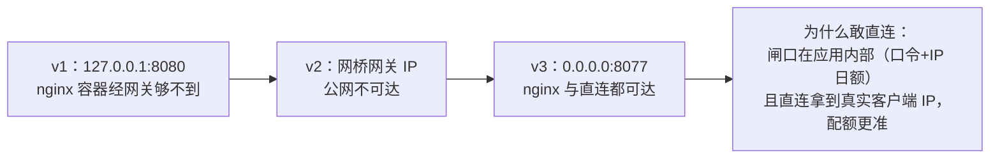
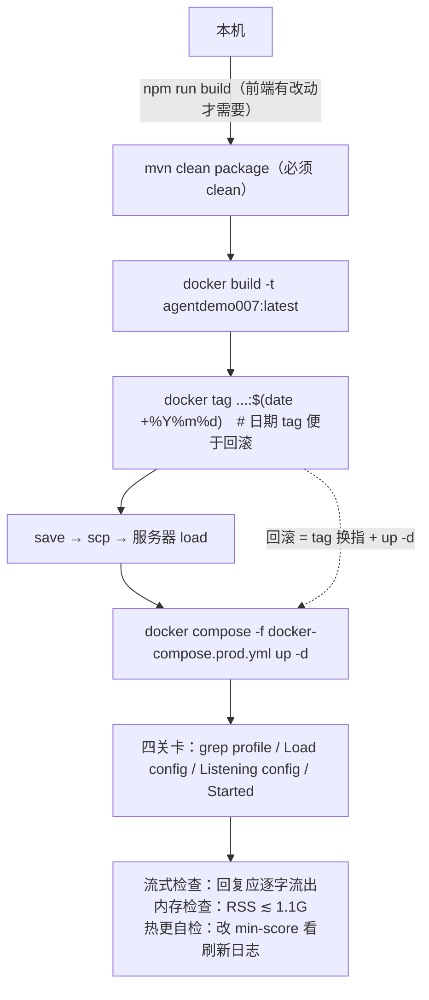

# 部署交付实录：一进程即整站——从 localhost 到公网

> **语言 / Language**：中文 ｜ 系列第十二章（完结篇）（[目录](https://blog.csdn.net/qq_24993561/article/details/166257230)）｜ 上一章：[可观测性与审计](https://blog.csdn.net/qq_24993561/article/details/166257770)
>
> **项目**：Agentdemo007 —— 电商智能客服 Agent
> **技术栈**：Spring Boot 可执行 jar（~89MB，含 SPA）/ Docker（eclipse-temurin:17-jre）/ nginx 反代 / Nacos + MySQL + Redis + RabbitMQ + Chroma
> **周期**：2026-09-18 访问闸门上线（公网前置）→ 09-20 首次公网部署 + 提交制审批收口
> **验证规模**：15+ 个真实部署问题的现象→根因→修复（完整手册见[部署实录](https://github.com/Gavincui123/Agentdemo007/blob/master/docs/guides/%E9%83%A8%E7%BD%B2%E5%AE%9E%E5%BD%95.md)，本章是叙事版）
> **源码**：[github.com/Gavincui123/Agentdemo007](https://github.com/Gavincui123/Agentdemo007)

---

## 核心结论（TL;DR）

部署不是"把 jar 扔上去"。首次公网部署当天闭环炸出来的问题，九成不是代码问题，是**环境语义与代码假设的错位**。本章挑最有普遍性的九个，按"现象→根因→修复"给出；操作层面的完整清单在番外手册里，不重复。

| # | 现象 | 根因 | 修复 |
|---|---|---|---|
| 1 | 启动即报 `/var/log/agentdemo007/...` 创建失败 | profile 写死 prod，日志路径归 root | `spring.profiles.active: ${SPRING_PROFILES_ACTIVE:dev}`——"profile 永远不写死在代码里" |
| 2 | Nacos 配置静默没加载 | dataId 写死 + `optional:` 吞掉失败 | dataId 占位符化；部署后必查 `grep "Load config"` |
| 3 | 容器里连不上任何中间件 | 127.0.0.1 是容器自己 | 全部改 `host.docker.internal`（compose extra_hosts） |
| 4 | `CREATE command denied ... for table 'chat_turn'`（表都建好了） | MySQL 在发现表已存在**之前**先做权限校验 | 授权必须包含 CREATE |
| 5 | jar 里 chunk 越打越多 | resources 插件只复制不清理，Vite hash 换名留孤儿 | `mvn clean package`——"必须 clean" |
| 6 | nginx 改完配置页面没变 | `nginx -t` 失败 → reload 从未成功，"页面不变≠没生效，= 没加载成功" | 先 `-t` 后 reload，接手既有 nginx 先查三样 |
| 7 | 每请求换个假 XFF 就是无限额度 | 客户端可伪造 X-Forwarded-For | 信任链：nginx `proxy_set_header X-Real-IP $remote_addr` 覆写 → 闸口只信覆写值 |
| 8 | 流式回复憋到最后一次性吐出 | 反代缓冲了 event-stream | `proxy_buffering off` + 读超时 180s |
| 9 | 想杀的进程不敢杀 | `ps` 里的可疑进程是 HIDS 探针 | "杀进程前先认亲"——先 `systemctl list-units` + `ps -ef` 看清身份 |

---

## 一、一进程即整站：单 jar 的取舍

部署形态一句话（DEPLOY.md 开头原文）："单 jar 单体部署：前端 SPA（Vue 3 / Vite）构建时直出后端 classpath:/static/，由 mvn 打入可执行 jar；后端同源托管静态资源并对外提供全部 API 与 Actuator。**一进程即整站**，无需独立前端服务器、无需 Nginx SPA fallback。"

2核4G 的小服务器决定了这个形态：JVM 口径堆 800m + Metaspace 256m、容器上限 1280m、`-XX:+ExitOnOutOfMemoryError`——**OOM 即重启**比 OOM 后半死不活更可控。服务器上不做前端构建、不做 Maven 构建——jar 在本机构建后上传服务器，省内存省时间；镜像用 `docker save/scp/load` 整体搬运——生产服务器连 Docker Hub 都不依赖（第一次部署时 `dial tcp ...:443: connect: connection refused`，DNS 被污染，从此镜像自给自足）。

**打包含糊不得**——这是最隐蔽的坑："maven-resources-plugin 只把 src/main/resources/* 复制进 target/classes/，不删除孤儿文件；Vite content-hash 每次构建都给 chunk 换名"——不带 clean 的 `mvn package` 会把历代 JS chunk 全部攒进 jar（实测 15 个变 24 个）。教训："**必须 clean**"是发布流程里写死的步骤，不是建议。

## 二、配置的三条纪律：不写死、必验证、知边界

**① 不写死**。profile 写死 prod 的代价是启动即炸（现象 #1）；dataId 写死的代价是换环境要改代码。修完的 import 长这样：

```yaml
# application.yml —— 占位符可从 OS 环境变量解析
spring.config.import: optional:nacos:${NACOS_DATA_ID:Agentdemo007.yaml}?group=DEFAULT_GROUP
```

**② 必验证**。`optional:` 是双刃剑——配置中心整个失联时应用照常启动（零外部依赖公理的延伸），但"配置没加载"没有报错，只有"该有的配置没有"。部署实录的对策是把验证写进发布检查："部署后必查这行：`docker logs agentdemo007 2>&1 | grep "Load config"`"。

**③ 知边界**。Nacos 热更新的能力边界要背下来（DEPLOY.md 原话）：

> 没有 @RefreshScope……仅实时读取方随后生效，任何 bean 都不重建……本项目消费方式绝大多数落 ❌ 侧——**生产改配置以重启为准。改完没生效，先确认消费者的读取方式——这不是 bug。**

闸口旋钮、提示词模板、黄金集这三类是实时读取方（热更 ✅）；数据源、连接池这类装配期 bean 落 ❌ 侧。另有一个 namespace 陷阱："`NACOS_NAMESPACE=public` 填的是显示名——namespace 参数必须填命名空间 **ID**，public 命名空间的 ID 是空串，留空即 public"。

## 三、容器网络与 MySQL：第一个炸的不是唯一错的

容器里 `127.0.0.1` 是容器自己——MySQL 只是第一个炸的，"不是唯一错的"，dataId 里四处地址（MySQL/Redis/RabbitMQ/Chroma）全改 `host.docker.internal`（compose 已配 `extra_hosts`）。

MySQL 授权连踩两坑，第二个最有教育意义：表建好了，启动仍报 `CREATE command denied ... for table 'chat_turn'`。根因："MySQL 在发现表已存在之前就先做权限校验，所以**表建好了也必须有 CREATE 权限**"。加上 prod 的 `ddl-auto: none` + `sql.init.mode: always`，还埋过一个静默坑：schema.sql 不显式指定 location 时 prod 将不建任何表，"运行期所有 SQL 报错"——三件套（授权、location、ddl-auto）缺一不可。

## 四、端口绑定三次演进：0.0.0.0 赢在哪




v1 `127.0.0.1` 端口冲突且 nginx 够不到；v2 绑网桥网关 IP 公网不可达；v3 定稿 `0.0.0.0:8077:8080`。值得展开的是"为什么敢直连发布"：闸口（口令 + IP 日额 + eval 封锁）在**应用内部**，不依赖网络位置——直连反而拿到真实客户端 IP，配额更准。安全放在应用里而不是拓扑里，是这套部署最有价值的一个决策。

nginx 侧三条铁律（conf 原文）：

```nginx
# 闸口配额键：必须由 nginx 覆写 X-Real-IP（$remote_addr），防客户端伪造 XFF 刷每日额度
proxy_set_header X-Real-IP $remote_addr;

# SSE 流式必需：禁缓冲 + 读超时 > 应用 SSE 窗口 120s
proxy_buffering off;
proxy_cache off;
proxy_read_timeout 180s;
```

接手既有 nginx 的教训（现象 #6/#9）浓缩成两句："动别人（既有的）nginx 前先查三样：Mounts（配置挂载在哪）、conf.d 是否被 include、现有 server 块"；"`nginx -t` 失败不影响运行中的实例——reload 从未成功，页面不变≠没生效，= 没加载成功"。以及那条让人后背发凉的——**杀进程前先认亲**："heyeAgent=百度 HIDS，不是你的业务进程；`ps -ef` + `ss -tlnp` 双重确认"。

## 五、安全收尾：公网清单与诚实标注

首次公网发布前的安全清单（以部署实录 §7 为主，综合 DEPLOY.md 发布清单与[第六章](https://blog.csdn.net/qq_24993561/article/details/166257730)的取 IP 修复链，逐条可执行）：

1. **端口收敛**："安全组只放 80 / 443 / 8077；3379 / 6379 / 5672 / 15672 / 8001 / 8848 / 9848 / 8000 全部关闭或限自有 IP（当前这些中间件全部在公网裸着，Redis/Nacos 优先处理）"——清单里保留了当时的未完成态，修完才勾。
2. **密钥治理**："全部密钥经环境变量注入，配置文件仅 ${} 占位，不落明文"；dataId 里写 `${SF_KEY}` 占位、值放服务器环境变量；`.env.prod` 不进仓库（已核实 .gitignore 挡住），权限收 600 仍是待办。
3. **口令只放 Nacos**：闸口 dataId `agentdemo-gate.json` 的字段注释逐字——`"accessCode": "<你的访问口令>"  // 只放 Nacos，勿入仓库/环境变量明文`。
4. **闸口发布四步**："Nacos 建 agentdemo-gate.json → 确认 REDIS_ENABLED=true（配额持久化）→ nginx proxy_set_header X-Real-IP（IP 防伪信任链前提）→ 安全组只放 80/443/8077"。
5. **IP 伪造刷额度**（现象 #7）的完整修复链：最初解析顺序 XFF 优先——"XFF 是请求头，客户端想写什么写什么，每请求换一个假 XFF 就是无限份『新鲜额度』"；修复后顺序 X-Real-IP（nginx 覆写）→ XFF 第一跳 → TCP 对端，并诚实标注边界（直连场景信任 TCP 对端）。

配置加载优先级一句话记牢："OS 环境变量 > Nacos dataId > 本地 yml"。

## 六、更新与回滚：日期 tag 与四关卡验证



流程的设计逻辑："配置和数据全在容器外（Nacos / MySQL / Redis / 挂载卷），重建容器不丢。改 Nacos 配置不用重新打包；改后端/前端必须走全流程。回滚：`docker tag agentdemo007:20260919 agentdemo007:latest && up -d`"——**回滚是换指针，不是重新构建**。

验证清单里最容易被跳过也最不该跳过的两项："流式检查：回复应逐字流出（若憋到最后一次性吐出，检查反代 buffering）"和热更自检（"改 Nacos dataId 里 app.rag.min-score 发布，数秒内日志出现 Refresh 事件"）——一个验证 SSE 链路，一个验证配置链路，都是"页面打开了"验证不出来的。

## 七、经验小结

1. **环境语义与代码假设的错位是部署事故的第一大来源**：127.0.0.1、写死的 profile、显示名 vs ID、权限校验时序——全是"代码假设 A，环境语义 B"。
2. **`optional:` 这类宽容配置必须配对一条验证命令**：宽容了失败就要人工确认成功。
3. **安全放在应用内部而不是拓扑里**：闸口在应用内，直连发布反而拿到更准的客户端 IP。
4. **信任链要写进配置注释**：X-Real-IP 覆写 → 闸口信任——信任链断一环，额度系统就是摆设。
5. **发布流程里"必须 clean / 必查 grep / 必测流式"是血泪换来的硬步骤**：清单化的意义是让它们不依赖记忆。
6. **回滚设计成换指针**：日期 tag + 容器外配置数据，回滚成本≈一条命令。

## 八、已知边界（诚实清单）

1. **安全清单是快照不是定局**：中间件端口收敛、Nacos 鉴权、dataId 内密钥轮换，清单保留了"当前未完成"的原文——公开发布前必须逐条勾完（这是部署实录 §7 的原话，不是本章转述）。
2. **无 @RefreshScope**：非实时读取方的配置改动以重启为准（§二③）。
3. **双源提示词与本地默认无 diff 校验**（[第二章](https://blog.csdn.net/qq_24993561/article/details/166257780)同条）。
4. **密钥启动校验类不存在**：application-prod.yml 注释承诺"启动校验拒绝明文"但代码未实现（DEPLOY.md"已知缺口"登记）——承诺与实现的对账同样适用于部署文档。

---

*本文机制出处：`DEPLOY.md`、`docs/guides/部署实录.md`（15+ 问题完整版）、`deploy/nginx-agentdemo007.conf`、`docker-compose{,.prod}.yml`、`Dockerfile`、`src/main/resources/application*.yml`、`gate/AccessGateFilter`。*

> 相关阅读：[系列目录](https://blog.csdn.net/qq_24993561/article/details/166257230) · [上一章：可观测性与审计](https://blog.csdn.net/qq_24993561/article/details/166257770) · [第六章·闸口旋钮的设计裁决](https://blog.csdn.net/qq_24993561/article/details/166257730) · [部署实录（番外·操作手册）](https://github.com/Gavincui123/Agentdemo007/blob/master/docs/guides/%E9%83%A8%E7%BD%B2%E5%AE%9E%E5%BD%95.md) —— **系列完**
